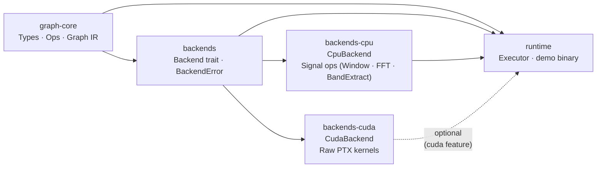
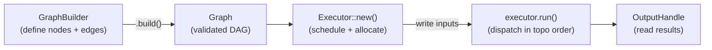

# graphynx

graphynx is a **backend-agnostic dataflow graph execution engine** in Rust.
Users define computation as a directed graph of typed nodes. The engine schedules
and executes nodes in dependency order, dispatching work to whichever backend a
node targets — signal processing on CPU, raw CUDA kernels on GPU, or primitive
ML operations.

## Crate Workspace



## Backends

| Backend | Kind | Status |
|---|---|---|
| CPU (`backends-cpu`) | Signal ops (Window, FFT, BandExtract) | ✅ implemented |
| CUDA (`backends-cuda`) | Raw compute kernels (PTX) | 🔧 in progress |
| OpenCL | Compute | planned |
| Vulkan / wgpu | Compute | planned |
| ONNX Runtime | ML inference | planned |
| libtorch | ML ops + inference | planned |
| candle / burn | ML ops + inference | planned |

## Execution Pipeline



## Getting Started

### Prerequisites

- [Nix](https://nixos.org/) with flakes enabled
- NVIDIA GPU + driver (for CUDA backend only)

### Build

```bash
# Enter the reproducible dev shell (sets CUDA_PATH, RUSTFLAGS, etc.)
nix develop

# Build all crates
nix develop --command cargo build
```

### Run the demo

The demo binary requires a CUDA-capable GPU and the `cuda` feature:

```bash
nix develop --command cargo run --bin demo --features cuda
```

### Test

```bash
nix develop --command cargo test
nix develop --command cargo tarpaulin   # coverage report
```

### Lint

```bash
nix develop --command cargo clippy
nix develop --command cargo fmt --check
nix develop --command cargo deny check
```

## Quick Example — Signal Processing Graph

```rust
use graph_core::{
    graph::GraphBuilder,
    ops::{
        Op,
        signal::{
            BandDef, BandExtractParams, FftDirection, FftOutput, FftParams,
            WindowKind, WindowParams,
        },
    },
    types::TensorType,
};
use backends_cpu::CpuBackend;
use runtime::executor::Executor;

let n: usize = 1024;
let sr: f32 = 44_100.0;
let spectrum_len = n / 2 + 1;

let bands = vec![
    BandDef::new(20.0,     250.0,    "low").unwrap(),
    BandDef::new(250.0,    4_000.0,  "mid").unwrap(),
    BandDef::new(4_000.0,  20_000.0, "high").unwrap(),
];

let graph = GraphBuilder::new()
    .source("audio", TensorType::f32_1d(n))
    .add_node("window")
        .device("cpu:0")
        .op(Op::Window(WindowParams::new(WindowKind::Hann, n).unwrap()))
        .input_from_source("audio")
        .output(TensorType::f32_1d(n))
        .done()
    .add_node("fft")
        .device("cpu:0")
        .op(Op::Fft(FftParams::new(n, FftDirection::Forward,
                                   FftOutput::Magnitude).unwrap()))
        .input_from("window", 0)
        .output(TensorType::f32_1d(spectrum_len))
        .done()
    .add_node("bands")
        .device("cpu:0")
        .op(Op::BandExtract(BandExtractParams::new(bands, sr, 0.1).unwrap()))
        .stateful()
        .input_from("fft", 0)
        .output(TensorType::f32_1d(3))
        .done()
    .sink("energies", TensorType::f32_1d(3))
        .from("bands", 0)
        .done()
    .build()
    .unwrap();

let backend: Box<dyn backends::Backend> = Box::new(CpuBackend::new("cpu:0"));
let mut exec = Executor::new(graph, vec![backend]).unwrap();

// Run one frame
let samples = vec![0.0_f32; n];
exec.input("audio").unwrap().write("audio", samples.as_slice()).unwrap();
exec.run().unwrap();
let energies: &[f32] = exec.output("energies").unwrap().read().unwrap();
println!("Band energies: {:?}", energies);
```

See [docs/signal-ops.md](docs/signal-ops.md) for the full signal processing guide.

## Project Structure

```
graphynx/                         # Cargo workspace root
├── core/                         # graph-core — pure backend-agnostic types
│   └── src/
│       ├── types/                # DType · Dim · Layout · TensorType · Shape
│       ├── ops/                  # Op enum · OpError · ML + Signal param structs
│       └── graph/                # Graph IR · GraphBuilder · Node · Edge · validator
├── backends/                     # backends — Backend trait · BackendError · DeviceId
├── backends-cpu/                 # backends-cpu — CpuBackend (signal ops)
│   └── src/signal/               # window.rs · fft.rs · band.rs
├── backends-cuda/                # backends-cuda — CudaBackend (raw PTX kernels)
│   ├── kernel.cu                 # CUDA C kernel source
│   ├── compile-kernel.sh         # compiles kernel.cu → kernel.ptx
│   └── build.rs                  # emits CUDA linker search paths
└── runtime/                      # runtime — Executor · demo binary
    └── src/executor/             # scheduler · buffer arena · handles · state
```

## Documentation

| Document | Description |
|---|---|
| [ARCHITECTURE.md](ARCHITECTURE.md) | Full long-term architecture plan |
| [docs/architecture.md](docs/architecture.md) | Current code structure overview |
| [docs/getting-started.md](docs/getting-started.md) | Build, test, and first steps |
| [docs/executor.md](docs/executor.md) | Executor developer guide |
| [docs/signal-ops.md](docs/signal-ops.md) | Signal processing ops guide (Window · FFT · BandExtract) |
| [docs/graph-ir.md](docs/graph-ir.md) | Graph IR and builder API |
| [docs/op-catalog.md](docs/op-catalog.md) | Op enum and parameter structs |
| [docs/backend-trait.md](docs/backend-trait.md) | Backend trait system |
| [docs/tensor-type.md](docs/tensor-type.md) | TensorType, Dim, Layout |
| [docs/shape.md](docs/shape.md) | Shape, broadcasting, strides |
| [docs/dtype.md](docs/dtype.md) | DType scalar element types |
| [docs/cuda-backend.md](docs/cuda-backend.md) | CUDA backend details |

## License

Licensed under the MIT License — see [LICENSE](LICENSE) for details.
