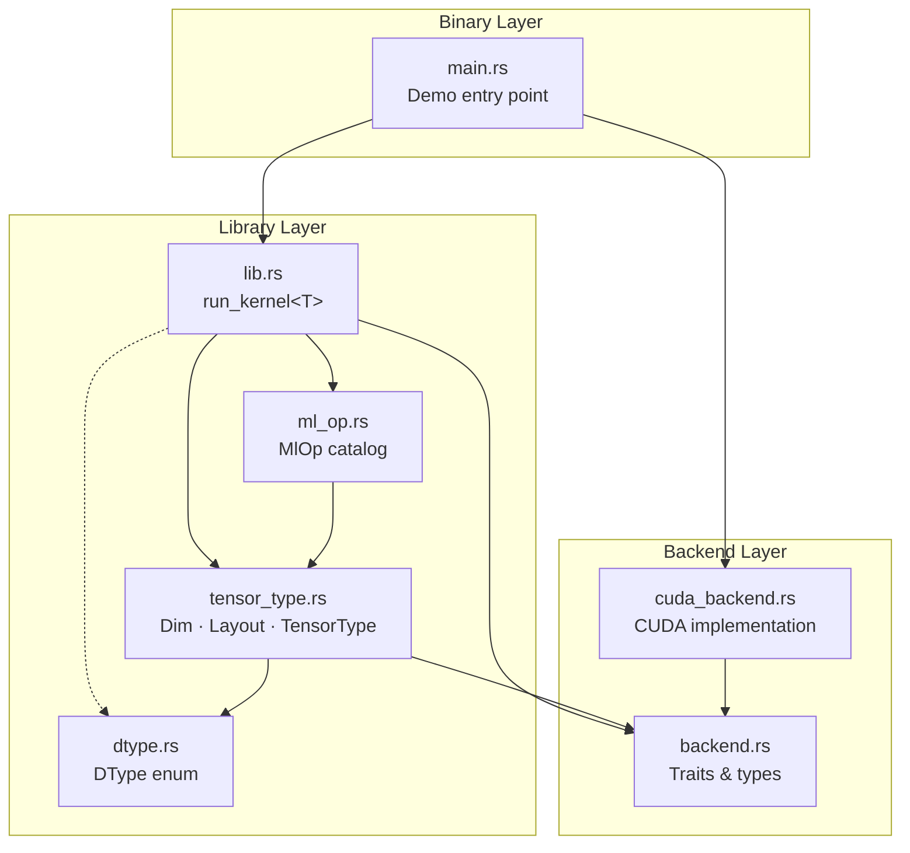
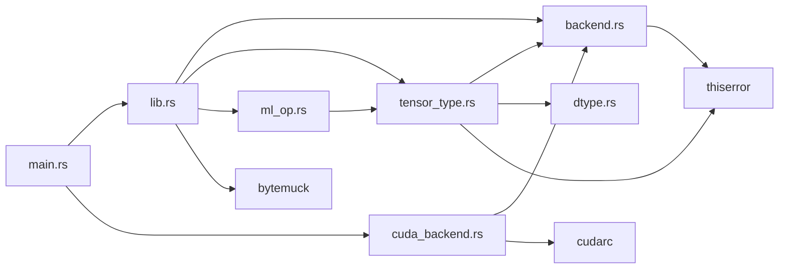
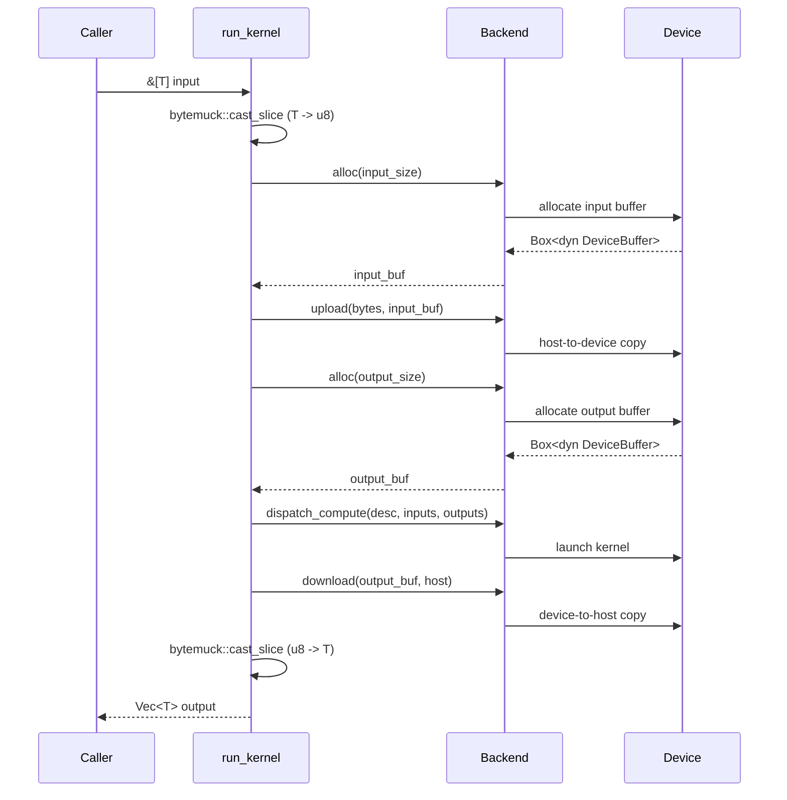
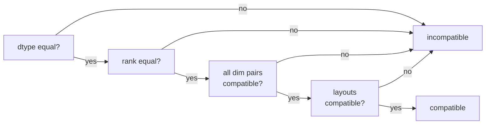

# Architecture Overview

Graphynx is a graph-based runtime for heterogeneous CPU-GPU computation. This document describes the current code structure, the layered architecture, and how the major components interact.

## Layered Design

The system is organized into three layers. Each layer depends only on the layers below it.

### Core Abstractions (backend.rs)

The `backend` module defines the foundational traits and types that all backends must implement. It has zero dependencies on any GPU SDK.

### Backend Implementations (cuda_backend.rs)

Concrete backend implementations live in their own modules and depend on the core abstractions. Currently only a CUDA backend exists.

### Library API (lib.rs)

The top-level `run_kernel<T>` function provides a convenient typed wrapper over the byte-oriented backend interface.

### Type System (dtype.rs, tensor_type.rs)

The type system describes tensor data flowing through the computation graph:

- **`dtype.rs`** — `DType` enum: scalar element types (`F32`, `I32`, `U8`, …). Zero dependencies.
- **`tensor_type.rs`** — `Dim`, `Layout`, `TensorType`, `TensorTypeBuilder`: full tensor metadata including shape, layout, optional device placement, and dimension names. Depends only on `dtype` and `backend::DeviceId`. See [tensor-type.md](tensor-type.md) for full documentation.
- **`ml_op.rs`** — `MlOp` enum: curated catalog of primitive ML operations (`Conv2d`, `MatMul`, `Relu`, …) and their parameter structs. Depends only on `tensor_type::Dim`. See [ml-op.md](ml-op.md) for full documentation.

## Module Dependency Graph

## Data Flow

When `run_kernel<T>` is called, data flows through these stages:

## Source File Map

| File | Lines | Purpose |
|---|---|---|
| `src/lib.rs` | ~46 | Crate root. Declares modules, exposes `run_kernel<T>`. |
| `src/backend.rs` | ~658 | Core traits: `Backend`, `DeviceBuffer`, `KernelDescriptor`. Error types, `DeviceId`, `BackendCaps`. |
| `src/cuda_backend.rs` | ~373 | CUDA implementation: `CudaBackend`, `CudaBuffer`, `CudaKernelDesc`. |
| `src/dtype.rs` | ~640 | `DType` enum with size, alignment, naming, and category helpers. |
| `src/tensor_type.rs` | ~860 | Tensor type system: `Dim`, `Layout`, `TensorType`, `TensorTypeBuilder`, `TensorTypeError`. |
| `src/ml_op.rs` | ~590 | ML op catalog: `MlOp` enum and all per-op parameter structs. |
| `src/main.rs` | ~43 | Binary demo: loads PTX, runs `hello_kernel` on GPU. |
| `build.rs` | ~27 | Build script: emits CUDA linker search paths from `CUDA_PATH`/`NVRTC_PATH`. |
| `kernel.cu` | ~17 | CUDA C kernel source (doubles each array element). |
| `compile-kernel.sh` | ~17 | Compiles `kernel.cu` to `kernel.ptx` via `nvcc`. |

## Key Design Principles

1. **Zero backend dependencies in the core layer** — `backend.rs`, `dtype.rs`, and `tensor_type.rs` compile without any GPU SDK.
2. **All unsafe confined to backend implementations** — the core library is 100% safe Rust.
3. **Invalid states are unrepresentable** — `TensorType` uses private fields and validated constructors; there is no way to construct a `TensorType` with a zero dimension, mismatched dim names, or a wrong-rank image layout.
4. **Byte-oriented backend interface** — the `Backend` trait operates on `&[u8]` and `Box<dyn DeviceBuffer>`. Type erasure happens at the `run_kernel` boundary via `bytemuck`.
5. **Trait-based extensibility** — `KernelDescriptor` is a trait (not an enum), so new kernel descriptor types can be added without modifying core code.
6. **Capability-based dispatch** — `BackendCaps` declares what a backend supports (`Compute`, `MlOp`, `MlModel`) and its memory model (`Explicit` or `Managed`).

## Tensor Type System

`TensorType` is the core metadata type describing tensors on graph edges. It combines:

- **`DType`** — scalar element type (e.g. `F32`, `I32`)
- **`Vec<Dim>`** — shape as a list of `Fixed(n)`, `Dynamic`, or `Symbolic("batch")` dimensions
- **`Layout`** — memory layout (`RowMajor`, `ColMajor`, `NCHW`, `NHWC`, `Any`)
- **`Option<Vec<String>>`** — optional human-readable dimension names
- **`Option<DeviceId>`** — optional device placement

`TensorType::is_compatible_with` implements the graph-edge compatibility rules:

See [tensor-type.md](tensor-type.md) for the full API reference.

## Future Direction

See [ARCHITECTURE.md](../ARCHITECTURE.md) in the repository root for the full long-term plan, including:

- Graph IR with builder pattern (nodes, edges, `GraphBuilder`)
- ML operation catalog (`MlOp` enum) ✓ **implemented** — see [ml-op.md](ml-op.md)
- Execution layer (scheduler, buffer manager, executor)
- Multiple backend implementations (CPU, OpenCL, ONNX Runtime, etc.)
- Feature-gated backend compilation
