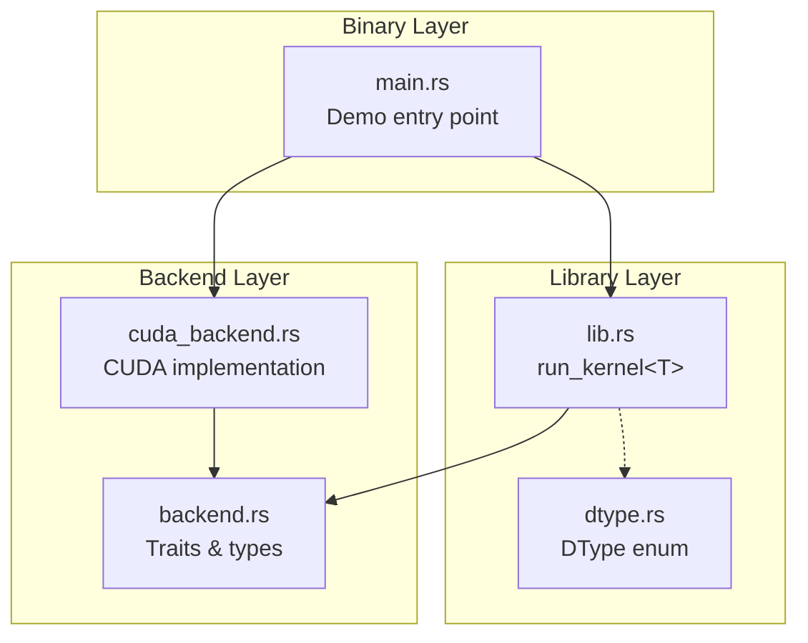
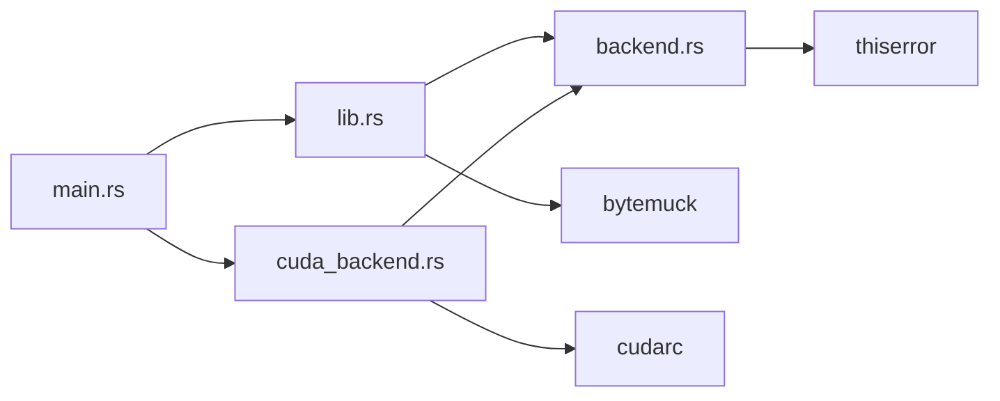
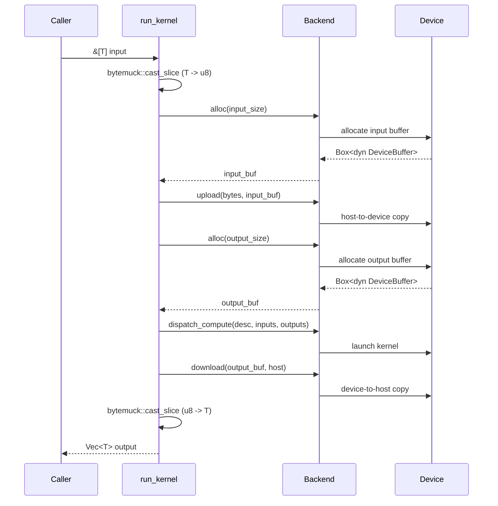

# Architecture Overview

Graphynx is a graph-based runtime for heterogeneous CPU-GPU computation. This document describes the current code structure, the layered architecture, and how the major components interact.

## Layered Design

The system is organized into three layers. Each layer depends only on the layers below it.

### Core Abstractions (backend.rs)

The `backend` module defines the foundational traits and types that all backends must implement. It has zero dependencies on any GPU SDK.

### Backend Implementations (cuda_backend.rs)

Concrete backend implementations live in their own modules and depend on the core abstractions. Currently only a CUDA backend exists.

### Library API (lib.rs)

The top-level `run_kernel<T>` function provides a convenient typed wrapper over the byte-oriented backend interface.

### Type System (dtype.rs)

The `DType` enum represents scalar element types for tensors and buffers. It is independent of all other modules.

## Module Dependency Graph

## Data Flow

When `run_kernel<T>` is called, data flows through these stages:

## Source File Map

| File | Lines | Purpose |
|---|---|---|
| `src/lib.rs` | ~44 | Crate root. Declares modules, exposes `run_kernel<T>`. |
| `src/backend.rs` | ~238 | Core traits: `Backend`, `DeviceBuffer`, `KernelDescriptor`. Error types, `DeviceId`, `BackendCaps`. |
| `src/cuda_backend.rs` | ~244 | CUDA implementation: `CudaBackend`, `CudaBuffer`, `CudaKernelDesc`. |
| `src/dtype.rs` | ~640 | `DType` enum with size, alignment, naming, and category helpers. |
| `src/main.rs` | ~39 | Binary demo: loads PTX, runs `hello_kernel` on GPU. |
| `build.rs` | ~27 | Build script: emits CUDA linker search paths from `CUDA_PATH`/`NVRTC_PATH`. |
| `kernel.cu` | ~17 | CUDA C kernel source (doubles each array element). |
| `compile-kernel.sh` | ~17 | Compiles `kernel.cu` to `kernel.ptx` via `nvcc`. |

## Key Design Principles

1. **Zero backend dependencies in the core layer** -- `backend.rs` and `dtype.rs` compile without any GPU SDK.
2. **All unsafe confined to backend implementations** -- the core library is 100% safe Rust.
3. **Byte-oriented backend interface** -- the `Backend` trait operates on `&[u8]` and `Box<dyn DeviceBuffer>`. Type erasure happens at the `run_kernel` boundary via `bytemuck`.
4. **Trait-based extensibility** -- `KernelDescriptor` is a trait (not an enum), so new kernel descriptor types can be added without modifying core code.
5. **Capability-based dispatch** -- `BackendCaps` declares what a backend supports (`Compute`, `MlOp`, `MlModel`) and its memory model (`Explicit` or `Managed`).

## Future Direction

See [ARCHITECTURE.md](../ARCHITECTURE.md) in the repository root for the full long-term plan, including:

- Tensor type system (`TensorType` with shape, layout, named dimensions)
- ML operation catalog
- Graph IR with builder pattern
- Execution layer (scheduler, buffer manager, executor)
- Multiple backend implementations (CPU, OpenCL, ONNX Runtime, etc.)
- Feature-gated backend compilation
