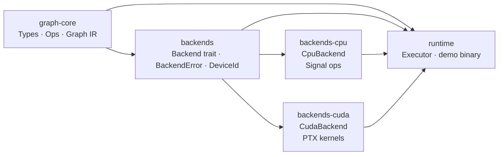
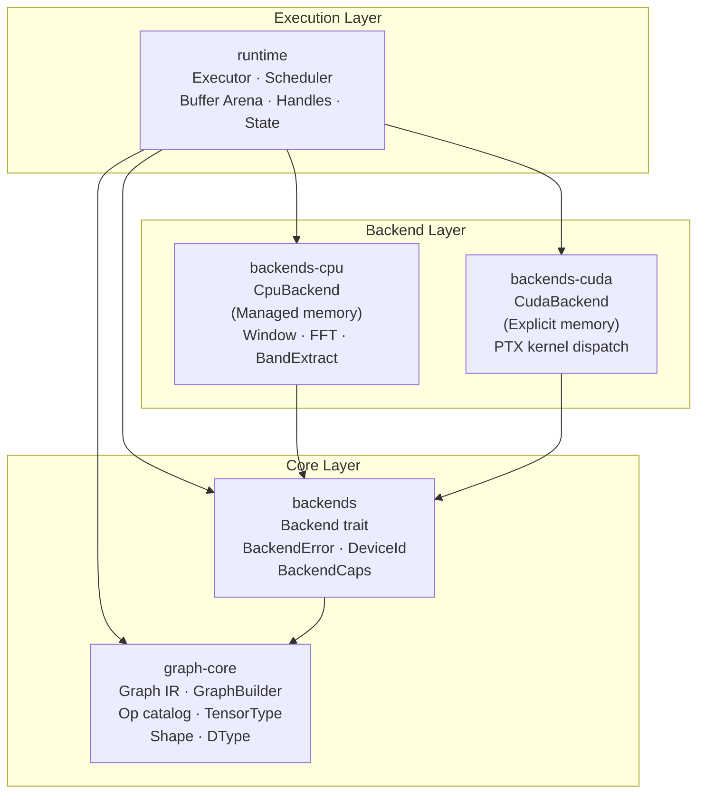
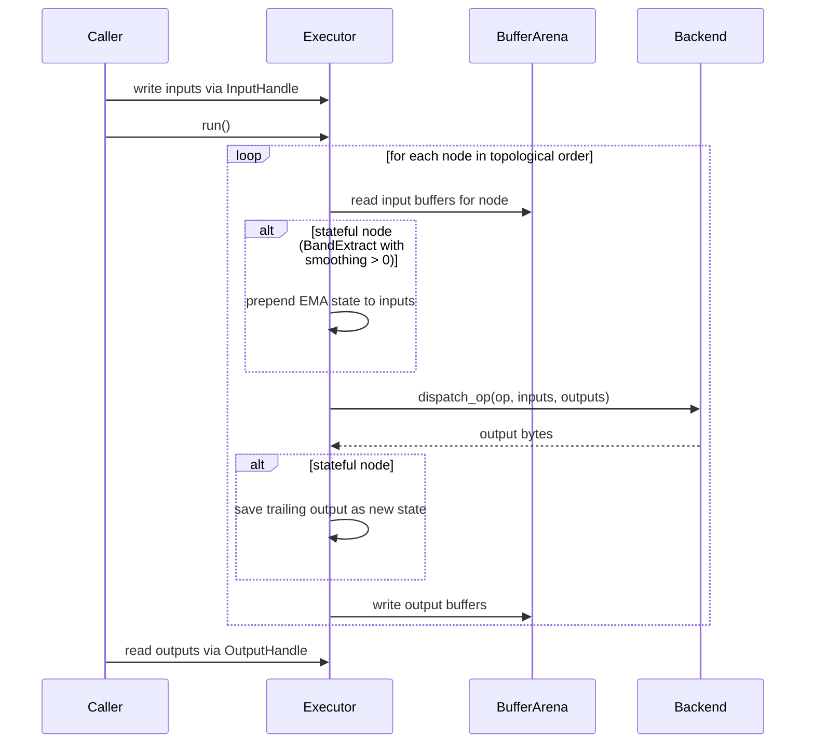
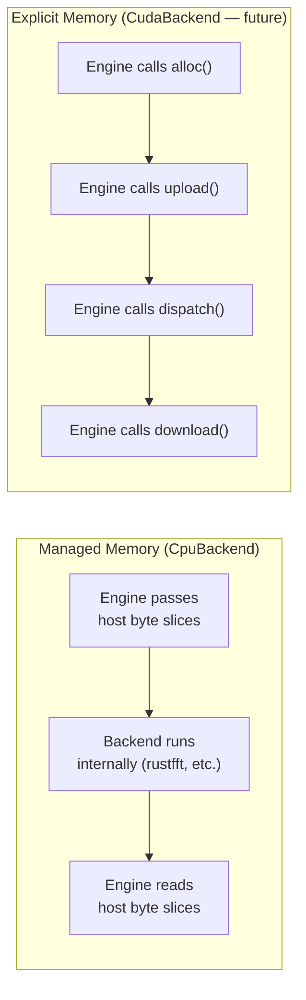
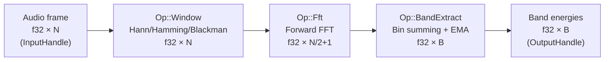
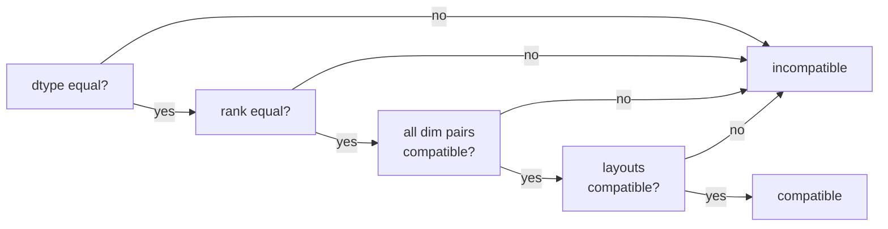

# Architecture Overview

Graphynx is a graph-based runtime for heterogeneous CPU-GPU computation. This
document describes the current workspace structure, the layered architecture,
and how the major components interact.

## Workspace Crate Dependency Graph

```mermaid
graph LR
    GC["graph-core\nTypes · Ops · Graph IR"]
    B["backends\nBackend trait · BackendError · DeviceId"]
    BC["backends-cpu\nCpuBackend\nSignal ops"]
    BX["backends-cuda\nCudaBackend\nPTX kernels"]
    RT["runtime\nExecutor · demo binary"]

    GC --> B
    B --> BC
    B --> BX
    GC --> RT
    B --> RT
    BC --> RT
    BX --> RT
```

**Key invariant:** `graph-core` and `backends` have zero dependencies on any
GPU SDK. They depend only on `std` and lightweight utility crates.

## Layered Design

The system is organised into three layers. Each layer depends only on the
layers below it.

```mermaid
graph TB
    subgraph "Execution Layer"
        RT2["runtime\nExecutor · Scheduler\nBuffer Arena · Handles · State"]
    end

    subgraph "Backend Layer"
        BC2["backends-cpu\nCpuBackend\n(Managed memory)\nWindow · FFT · BandExtract"]
        BX2["backends-cuda\nCudaBackend\n(Explicit memory)\nPTX kernel dispatch"]
    end

    subgraph "Core Layer"
        GC2["graph-core\nGraph IR · GraphBuilder\nOp catalog · TensorType\nShape · DType"]
        B2["backends\nBackend trait\nBackendError · DeviceId\nBackendCaps"]
    end

    RT2 --> BC2
    RT2 --> BX2
    RT2 --> GC2
    RT2 --> B2
    BC2 --> B2
    BX2 --> B2
    B2 --> GC2
```

## Executor Tick Lifecycle

On each `Executor::run()` call the executor dispatches nodes in topological
order through the registered backends.

```mermaid
sequenceDiagram
    participant Caller
    participant Executor
    participant Arena as BufferArena
    participant Backend

    Caller->>Executor: write inputs via InputHandle
    Caller->>Executor: run()

    loop for each node in topological order
        Executor->>Arena: read input buffers for node
        alt stateful node (BandExtract with smoothing > 0)
            Executor->>Executor: prepend EMA state to inputs
        end
        Executor->>Backend: dispatch_op(op, inputs, outputs)
        Backend-->>Executor: output bytes
        alt stateful node
            Executor->>Executor: save trailing output as new state
        end
        Executor->>Arena: write output buffers
    end

    Caller->>Executor: read outputs via OutputHandle
```

## Memory Models

```mermaid
graph LR
    subgraph "Managed Memory (CpuBackend)"
        M1["Engine passes\nhost byte slices"]
        M2["Backend runs\ninternally (rustfft, etc.)"]
        M3["Engine reads\nhost byte slices"]
        M1 --> M2 --> M3
    end

    subgraph "Explicit Memory (CudaBackend — future)"
        E1["Engine calls alloc()"]
        E2["Engine calls upload()"]
        E3["Engine calls dispatch()"]
        E4["Engine calls download()"]
        E1 --> E2 --> E3 --> E4
    end
```

The `MemoryModel` enum in `BackendCaps` tells the executor which path to take:

- **`Managed`** — backend handles its own memory; engine passes raw host bytes.
  Used by `CpuBackend` and ML runtime backends (ONNX Runtime, libtorch).
- **`Explicit`** — engine manages device memory through `alloc`/`upload`/`download`.
  Used by `CudaBackend`, OpenCL, etc.

## Data Flow — Signal Processing Example

```mermaid
flowchart LR
    A["Audio frame\nf32 × N\n(InputHandle)"]
    B["Op::Window\nHann/Hamming/Blackman\nf32 × N"]
    C["Op::Fft\nForward FFT\nf32 × N/2+1"]
    D["Op::BandExtract\nBin summing + EMA\nf32 × B"]
    E["Band energies\nf32 × B\n(OutputHandle)"]

    A --> B --> C --> D --> E
```

## Key Design Principles

1. **Zero backend dependencies in the core layer** — `graph-core` and `backends`
   compile without any GPU SDK.
2. **All unsafe confined to backend implementations** — the core library is 100%
   safe Rust.
3. **Invalid states are unrepresentable** — `TensorType`, `Shape`, `DeviceId`,
   `DType::custom()`, and all `Op` param structs use safe constructors with
   dedicated error types.
4. **Byte-oriented backend interface** — the `Backend` trait operates on `&[u8]`
   slices. Type erasure happens at the executor boundary via `bytemuck`.
5. **Trait-based extensibility** — `KernelDescriptor` is a trait (not an enum),
   so new kernel descriptor types can be added without modifying core code.
6. **Capability-based dispatch** — `BackendCaps` declares what a backend supports
   (`Compute`, `Op`, `MlModel`) and its memory model (`Explicit` or `Managed`).
7. **Stateful ops via state threading** — the executor persists EMA state across
   ticks by prepending/appending state buffers; the op itself is pure.

## Tensor Type System

`TensorType` is the core metadata type describing tensors on graph edges:

- **`DType`** — scalar element type (e.g. `F32`, `I32`)
- **[`Shape`](shape.md)** — validated tensor shape with `Fixed(n)`, `Dynamic`,
  or `Symbolic("batch")` dimensions
- **`Layout`** — memory layout (`RowMajor`, `ColMajor`, `NCHW`, `NHWC`, `Any`)
- **`Option<Vec<String>>`** — optional human-readable dimension names
- **`Option<DeviceId>`** — optional device placement

`TensorType::is_compatible_with` implements graph-edge compatibility rules:

```mermaid
flowchart LR
    A[dtype equal?] -->|no| FAIL[incompatible]
    A -->|yes| B[rank equal?]
    B -->|no| FAIL
    B -->|yes| C[all dim pairs<br/>compatible?]
    C -->|no| FAIL
    C -->|yes| D[layouts<br/>compatible?]
    D -->|no| FAIL
    D -->|yes| OK[compatible]
```

See [tensor-type.md](tensor-type.md) for the full API reference.

## Source File Map

| Crate | Key files | Purpose |
|---|---|---|
| `graph-core` | `core/src/types/` | `DType`, `Dim`, `Layout`, `TensorType`, `Shape` |
| `graph-core` | `core/src/ops/mod.rs` | `Op` enum, `OpError`, re-exports |
| `graph-core` | `core/src/ops/ml.rs` | ML param structs (`Conv2dParams`, `LinearParams`, …) |
| `graph-core` | `core/src/ops/signal.rs` | Signal param structs (`WindowParams`, `FftParams`, `BandExtractParams`) |
| `graph-core` | `core/src/graph/` | `Graph`, `GraphBuilder`, `Node`, `Edge`, validator |
| `backends` | `backends/src/lib.rs` | `Backend` trait, `BackendError`, `DeviceId`, `BackendCaps` |
| `backends-cpu` | `backends-cpu/src/lib.rs` | `CpuBackend` — managed-memory signal ops |
| `backends-cpu` | `backends-cpu/src/signal/` | `window.rs`, `fft.rs`, `band.rs` |
| `backends-cuda` | `backends-cuda/src/lib.rs` | `CudaBackend`, `CudaBuffer`, `CudaKernelDesc` |
| `backends-cuda` | `backends-cuda/kernel.cu` | CUDA C kernel source (doubles array elements) |
| `backends-cuda` | `backends-cuda/build.rs` | Emits CUDA linker search paths |
| `runtime` | `runtime/src/executor/mod.rs` | `Executor` — synchronous graph runner |
| `runtime` | `runtime/src/executor/scheduler.rs` | Topological sort |
| `runtime` | `runtime/src/executor/buffer.rs` | `BufferArena` — inter-node byte buffers |
| `runtime` | `runtime/src/executor/handle.rs` | `InputHandle`, `OutputHandle` |
| `runtime` | `runtime/src/executor/state.rs` | `ExecutionState` — EMA state persistence |
| `runtime` | `runtime/src/main.rs` | Demo binary — CUDA kernel demo |

## Further Reading

- [ARCHITECTURE.md](../ARCHITECTURE.md) — full long-term design plan
- [docs/getting-started.md](getting-started.md) — build, test, and first steps
- [docs/executor.md](executor.md) — executor developer guide
- [docs/graph-ir.md](graph-ir.md) — Graph IR and builder API
- [docs/signal-ops.md](signal-ops.md) — signal processing ops guide
- [docs/op-catalog.md](op-catalog.md) — `Op` enum and parameter structs
- [docs/backend-trait.md](backend-trait.md) — `Backend` trait system
- [docs/tensor-type.md](tensor-type.md) — `Dim`, `Layout`, `TensorType`
- [docs/shape.md](shape.md) — `Shape`, broadcasting, strides
- [docs/dtype.md](dtype.md) — `DType` scalar element types
- [docs/cuda-backend.md](cuda-backend.md) — CUDA backend details
