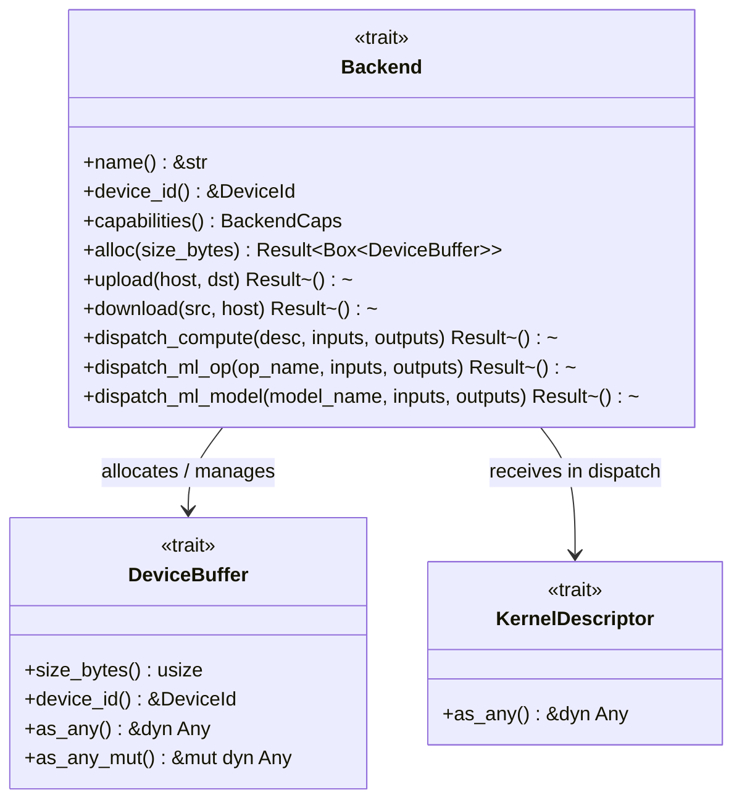
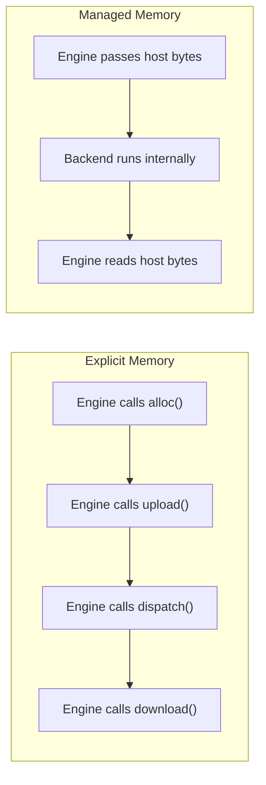
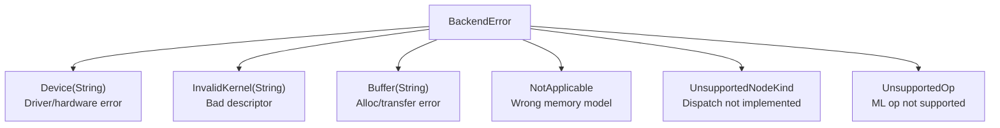
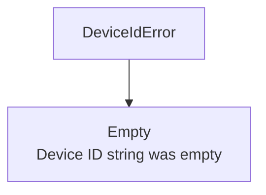

# Backend Trait System

The backend trait system defines the interface between the graph execution engine and the compute hardware. All types live in `src/backend.rs`.

## Trait Hierarchy



## Backend

The `Backend` trait is the unified interface for all compute and ML-runtime backends. Each implementation represents a single logical device or runtime.

### Required Methods

| Method | Description |
|---|---|
| `name()` | Human-readable name (e.g. `"cuda"`, `"cpu"`) |
| `device_id()` | Runtime identifier (e.g. `DeviceId("cuda:0")`) |
| `capabilities()` | Declares memory model and supported node kinds |
| `alloc(size_bytes)` | Allocate zeroed device buffer |
| `upload(host, dst)` | Copy host bytes to device buffer |
| `download(src, host)` | Copy device buffer to host bytes |

### Default Methods

These have default implementations that return `Err(BackendError::UnsupportedNodeKind)`:

| Method | Purpose |
|---|---|
| `dispatch_compute` | Execute a raw compute kernel |
| `dispatch_ml_op` | Execute a primitive ML operation |
| `dispatch_ml_model` | Run whole-model inference |

Backends override only the dispatch methods they support.

## Memory Models



The `MemoryModel` enum determines how the executor interacts with a backend:

- **`Explicit`** -- The engine manages device memory through `alloc`, `upload`, and `download`. Used by hardware backends (CUDA, OpenCL, CPU).
- **`Managed`** -- The backend handles its own memory. The engine passes raw host bytes in and out. Used by ML runtime backends (ONNX Runtime, libtorch).

## DeviceBuffer

A handle to memory on a device. The concrete type is opaque to the engine -- backends use `as_any()` downcasting internally to recover their specific buffer type.

```rust
pub trait DeviceBuffer: Send + Sync {
    fn size_bytes(&self) -> usize;
    fn device_id(&self) -> &DeviceId;
    fn as_any(&self) -> &dyn Any;
    fn as_any_mut(&mut self) -> &mut dyn Any;
}
```

## KernelDescriptor

A marker trait for backend-specific kernel descriptions. Each backend defines its own struct (e.g. `CudaKernelDesc`) and downcasts from `&dyn KernelDescriptor` in `dispatch_compute`.

```rust
pub trait KernelDescriptor: Any + Send + Sync {
    fn as_any(&self) -> &dyn Any;
}
```

## Supporting Types

### BackendError



All error variants use `thiserror` for `Display` and `Error` derivation. Variants carrying a `String` message convert foreign errors at FFI boundaries via `.map_err(|e| BackendError::Variant(e.to_string()))`.

### DeviceIdError



Errors produced when constructing a `DeviceId` through the safe constructor `try_new()`. Derives: `Debug`, `Error`, `Clone`, `Eq`, `PartialEq`.

### DeviceId

A validated identifier for a backend instance at runtime. The inner `String` field is **private** — use the constructors and `as_str()` accessor below.

Convention: `"<backend>:<index>"` for hardware (e.g. `"cuda:0"`), `"<runtime>:<device>"` for ML runtimes (e.g. `"onnx:cpu"`).

Derives: `Clone`, `Debug`, `Eq`, `PartialEq`, `Hash`. Implements `Display`.

#### Constructors

| Constructor | Parameters | Returns | Description |
|---|---|---|---|
| `DeviceId::try_new(id)` | `impl Into<String>` | `Result<DeviceId, DeviceIdError>` | Safe constructor — rejects empty strings |
| `DeviceId::new(id)` | `impl Into<String>` | `DeviceId` | Unchecked constructor for tests and known-good literals |

#### Accessor

| Method | Returns | Description |
|---|---|---|
| `as_str()` | `&str` | The device identifier as a string slice |

#### Examples

```rust
use graphynx::backend::DeviceId;

// Safe constructor
let id = DeviceId::try_new("cuda:0").unwrap();
assert_eq!(id.as_str(), "cuda:0");

// Empty string is rejected
assert!(DeviceId::try_new("").is_err());

// Unchecked constructor (for tests / known-good literals)
let id = DeviceId::new("cpu");
println!("{}", id); // "cpu"
```

### NodeKindTag

Tags the kinds of graph nodes a backend can execute:

| Variant | Description |
|---|---|
| `Compute` | Raw compute kernel (PTX, SPIR-V, WGSL, native Rust) |
| `MlOp` | Primitive ML operation from the curated catalog |
| `MlModel` | Opaque pre-trained model (ONNX, TorchScript, TFLite) |

### BackendCaps

```rust
pub struct BackendCaps {
    pub memory: MemoryModel,
    pub supported_kinds: Vec<NodeKindTag>,
}
```

Returned by `Backend::capabilities()` to tell the executor how to interact with the backend.

## Implementing a New Backend

1. Define your buffer type implementing `DeviceBuffer`
2. Define your kernel descriptor implementing `KernelDescriptor`
3. Implement `Backend` for your struct
4. Override the relevant `dispatch_*` methods
5. Return appropriate `BackendCaps` from `capabilities()`

See [cuda-backend.md](cuda-backend.md) for a concrete example.
