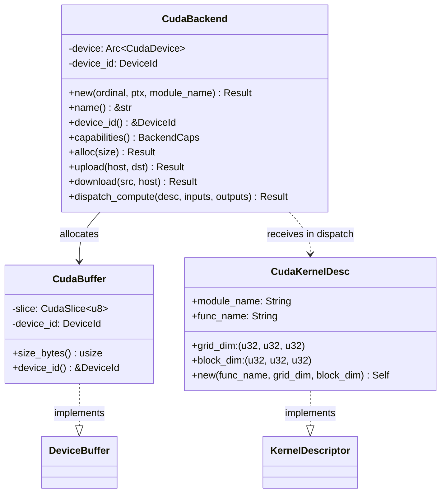
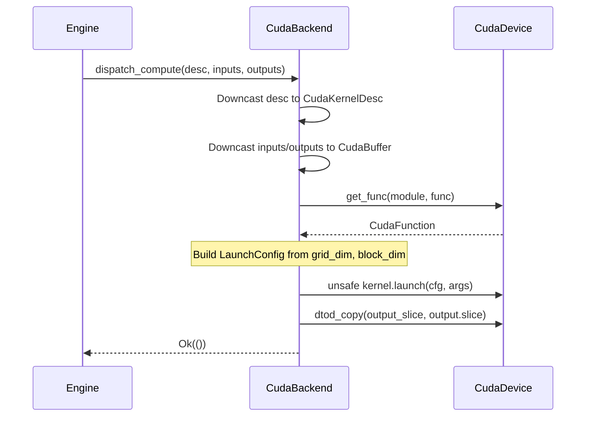

# CUDA Backend

The CUDA backend (`src/cuda_backend.rs`) is the first concrete implementation of the `Backend` trait. It wraps a single CUDA device and executes PTX kernels.

## Components



## CudaBackend

### Construction

```rust
let ptx = include_str!("../kernel.ptx");
let backend = CudaBackend::new(0, ptx, "hello")?;
```

`CudaBackend::new` performs three steps:
1. Opens the CUDA device at the given ordinal
2. Loads PTX source as a named module
3. Registers `"hello_kernel"` as an exported function

### Memory Model

`CudaBackend` uses `MemoryModel::Explicit`. The executor must call `alloc`, `upload`, and `download` to manage device memory.

### Capabilities

```rust
BackendCaps {
    memory: MemoryModel::Explicit,
    supported_kinds: vec![NodeKindTag::Compute],
}
```

Currently only `Compute` nodes are supported. `MlOp` support (cuBLAS, cuDNN) is planned.

## CudaBuffer

A device-side byte buffer. Wraps `cudarc::driver::CudaSlice<u8>` with a `DeviceId` to identify which device owns it.

Implements `DeviceBuffer` and `Clone`. The `Clone` implementation clones the underlying `CudaSlice` handle (reference-counted device allocation).

## CudaKernelDesc

Describes a PTX kernel and its launch configuration.

| Field | Type | Description |
|---|---|---|
| `module_name` | `String` | PTX module name for `get_func` lookup |
| `func_name` | `String` | Kernel function name inside the module |
| `grid_dim` | `(u32, u32, u32)` | Grid dimensions (blocks) |
| `block_dim` | `(u32, u32, u32)` | Block dimensions (threads per block) |

### Construction

```rust
let desc = CudaKernelDesc::new("hello_kernel", [1, 1, 1], [N as u32, 1, 1]);
```

`CudaKernelDesc::new` hardcodes the module name to `"hello"`. For custom module names, construct the struct directly:

```rust
let desc = CudaKernelDesc {
    module_name: "my_module".to_string(),
    func_name: "my_kernel".to_string(),
    grid_dim: (4, 1, 1),
    block_dim: (256, 1, 1),
};
```

## Dispatch Flow



### Current Limitations

- Only single-input / single-output kernels are supported
- The `new` constructor hardcodes `"hello_kernel"` as the registered function name
- `shared_mem_bytes` is always 0
- No `MlOp` or `MlModel` dispatch (defaults return `UnsupportedNodeKind`)

## Dependencies

The CUDA backend depends on `cudarc` 0.9 with the `driver` and `std` features. The `cudarc` crate provides safe Rust bindings to the CUDA driver API.

## Kernel Source

The demo kernel (`kernel.cu`) doubles every element of an integer array:

```c
extern "C" __global__ void hello_kernel(const int* in, int* out) {
    int idx = blockIdx.x * blockDim.x + threadIdx.x;
    out[idx] = in[idx] * 2;
}
```

Compile with `./compile-kernel.sh` inside `nix develop`. This produces `kernel.ptx` which is loaded by `CudaBackend::new`.
