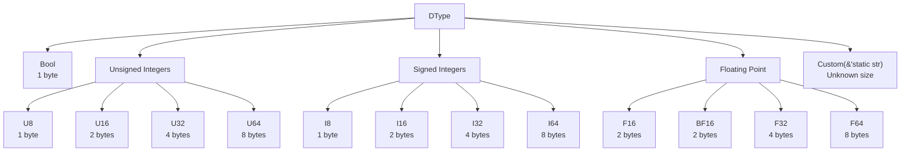

# DType -- Scalar Element Types

The `DType` enum in `src/dtype.rs` represents the scalar element type for tensors and buffers. It is the first component of the planned tensor type system.

## Variants



## Derives

`DType` derives: `Copy`, `Clone`, `Debug`, `Eq`, `PartialEq`, `Hash`.

This makes it usable as a `HashMap` key, freely copyable, and suitable for pattern matching.

## Methods

### Size and Alignment

| Method | Returns | Description |
|---|---|---|
| `size_bytes()` | `Option<usize>` | Byte size per element. `None` for `Custom`. |
| `alignment()` | `Option<usize>` | Natural alignment in bytes. Equals `size_bytes()` for all standard types. `None` for `Custom`. |

### Human-Readable Name

| Method | Returns | Description |
|---|---|---|
| `name()` | `&str` | Lowercase name: `"bool"`, `"u8"`, `"f32"`, `"bf16"`, etc. For `Custom(s)`, returns `s`. |

`Display` is also implemented, delegating to `name()`:

```rust
use graphynx::dtype::DType;

let dt = DType::F32;
println!("{}", dt);  // prints "f32"
println!("{:?}", dt); // prints "F32"
```

### Category Helpers

| Method | Returns `true` for |
|---|---|
| `is_float()` | `F16`, `BF16`, `F32`, `F64` |
| `is_int()` | `U8`-`U64`, `I8`-`I64` (not `Bool`) |
| `is_signed()` | `I8`-`I64`, `F16`, `BF16`, `F32`, `F64` |
| `is_unsigned()` | `Bool`, `U8`-`U64` |
| `is_custom()` | `Custom(_)` |

### Category Properties

- `is_float()` and `is_int()` are mutually exclusive for all concrete types
- `is_signed()` and `is_unsigned()` are mutually exclusive for all concrete types
- Every concrete type is either float, int, or `Bool`
- Every concrete type is either signed or unsigned
- `Custom` returns `false` for all category helpers except `is_custom()`

## Size Reference Table

| DType | `size_bytes()` | `alignment()` | `is_float()` | `is_int()` | `is_signed()` |
|---|---|---|---|---|---|
| `Bool` | 1 | 1 | false | false | false |
| `U8` | 1 | 1 | false | true | false |
| `U16` | 2 | 2 | false | true | false |
| `U32` | 4 | 4 | false | true | false |
| `U64` | 8 | 8 | false | true | false |
| `I8` | 1 | 1 | false | true | true |
| `I16` | 2 | 2 | false | true | true |
| `I32` | 4 | 4 | false | true | true |
| `I64` | 8 | 8 | false | true | true |
| `F16` | 2 | 2 | true | false | true |
| `BF16` | 2 | 2 | true | false | true |
| `F32` | 4 | 4 | true | false | true |
| `F64` | 8 | 8 | true | false | true |
| `Custom(s)` | None | None | false | false | false |

## Custom Variant

The `Custom(&'static str)` variant is an escape hatch for backend-specific types that the core layer doesn't know about (e.g. quantized formats like `q4_0`, `fp8_e4m3`). Its size, alignment, and category are all unknown.

Two `Custom` values are equal only if their string labels are identical:

```rust
assert_eq!(DType::Custom("q4"), DType::Custom("q4"));
assert_ne!(DType::Custom("q4"), DType::Custom("q8"));
assert_ne!(DType::Custom("f32"), DType::F32); // string label vs enum variant
```
