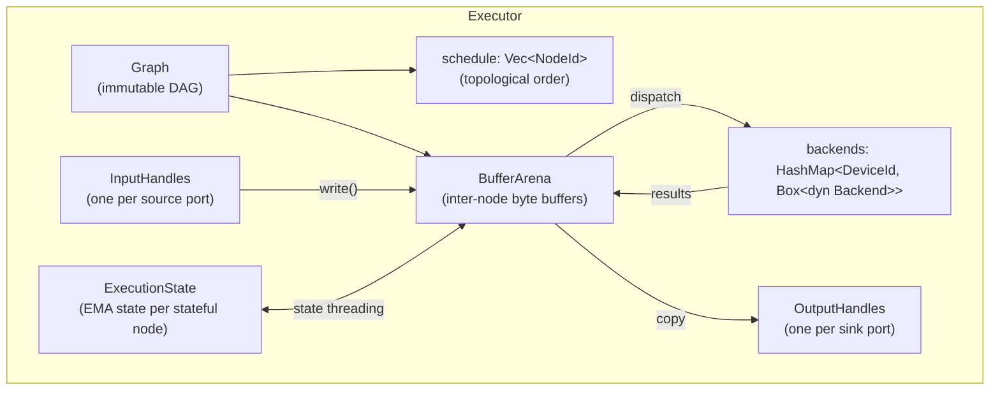
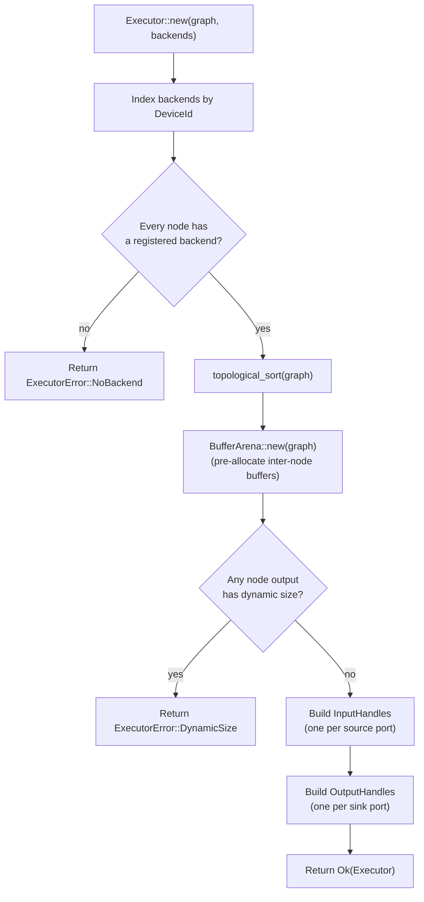
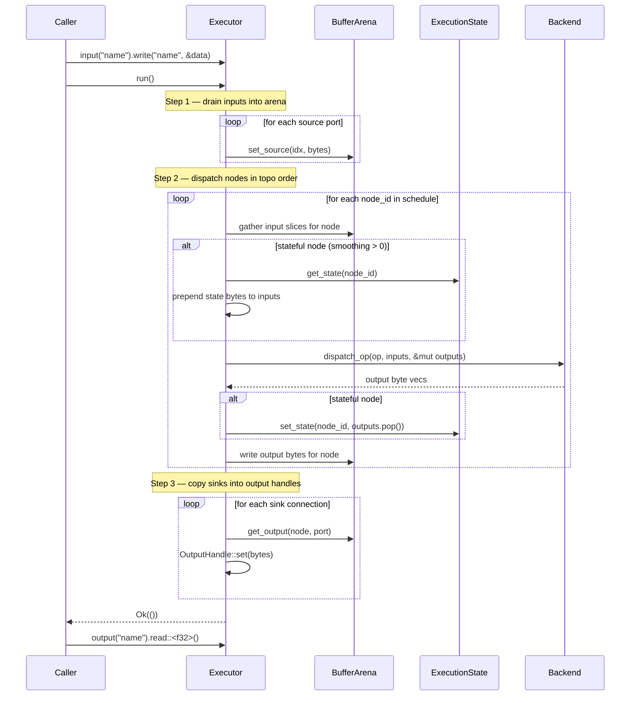
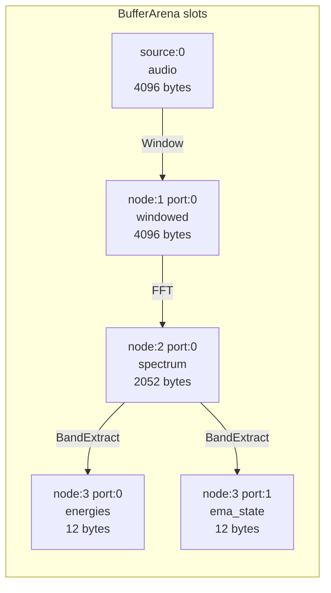
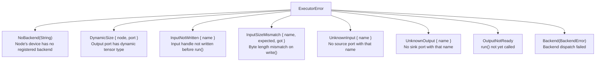

# Executor Developer Guide

The `Executor` is the synchronous graph runner in the `runtime` crate. It owns
a validated `Graph`, a set of registered backends, and pre-allocated inter-node
data buffers. On each `run()` call it dispatches nodes in topological order
through the registered backends.

## Component Overview



## Construction — `Executor::new()`



### Errors from `new()`

| Error | Cause |
|---|---|
| `ExecutorError::NoBackend(device)` | A node's `DeviceId` has no registered backend |
| `ExecutorError::DynamicSize(node, port)` | A node output has a dynamic tensor type (no statically-known byte size) |

## Run Loop — `Executor::run()`



### Errors from `run()`

| Error | Cause |
|---|---|
| `ExecutorError::InputNotWritten { name }` | An input handle was not written before `run()` |
| `ExecutorError::Backend(BackendError)` | A backend returned an error during dispatch |

## InputHandle and OutputHandle

### InputHandle

Obtained via `executor.input("name")`. Write data before each `run()` call.

```rust
// Typed write — reinterprets &[T] as &[u8] via bytemuck
exec.input("audio")?.write("audio", &samples_f32)?;

// Raw bytes write
exec.input("audio")?.write_bytes("audio", &raw_bytes)?;
```

**Errors:**
- `ExecutorError::InputSizeMismatch` — byte length does not match the tensor type's expected size.

### OutputHandle

Obtained via `executor.output("name")`. Read after `run()` returns `Ok(())`.

```rust
// Typed read — reinterprets stored bytes as &[T]
let energies: &[f32] = exec.output("energies")?.read()?;

// Raw bytes read
let raw: &[u8] = exec.output("energies")?.read_bytes();
```

**Errors:**
- `ExecutorError::OutputNotReady` — `run()` has not been called yet.
- `ExecutorError::OutputTypeMismatch` — requested type `T` has wrong alignment or size.

## BufferArena

`BufferArena` pre-allocates all inter-node byte buffers at construction time
(inside `Executor::new()`). Each node output port gets a fixed-size slot
computed from the port's `TensorType`.



No heap allocation occurs during `run()` — all buffers are reused across ticks.

## Stateful Nodes

Nodes with `stateful = true` and whose `Op::state_shape()` returns `Some` have
their state persisted in `ExecutionState` across `run()` calls.

```mermaid
stateDiagram-v2
    [*] --> FirstTick : zeros state (size from Op::state_shape())
    FirstTick --> SecondTick : state_1 saved in ExecutionState
    SecondTick --> ThirdTick : state_2 saved in ExecutionState
    ThirdTick --> NthTick : state_N-1 saved

    note right of FirstTick
        inputs  = [zeros, spectrum_0]
        outputs = [energies_0, state_1]
        state_1 saved → ExecutionState
    end note
```

**State protocol (executor ↔ backend):**

| Tick | Inputs to backend | Outputs from backend |
|------|-------------------|----------------------|
| First | `[zeros_state, data_0]` | `[result_0, new_state_0]` |
| Subsequent | `[prev_state, data_t]` | `[result_t, new_state_t]` |

The state slot is always the **last output** from the backend. The executor
saves it and prepends it as the **first input** on the next tick.

## Topological Scheduler

`scheduler::topological_sort(graph)` returns a `Vec<NodeId>` in an order
where every node appears after all its input dependencies. The sort is
deterministic (stable across identical graphs).

The schedule is computed once in `Executor::new()` and reused for every
`run()` call.

## ExecutorError Reference



## Full Example

```rust
use graph_core::{
    graph::GraphBuilder,
    ops::{Op, signal::{WindowKind, WindowParams, FftDirection, FftOutput, FftParams,
                       BandDef, BandExtractParams}},
    types::{DType, TensorType},
};
use backends::{Backend, DeviceId};
use backends_cpu::CpuBackend;
use runtime::executor::Executor;

let n: usize = 1024;
let sr: f32 = 44_100.0;
let cpu = DeviceId::new("cpu:0");

// 1. Build the graph
let mut b = GraphBuilder::new();
let audio_src = b.add_source("audio", TensorType::vector(DType::F32, n).unwrap());
let win  = b.add_op_node(Op::Window(WindowParams::new(WindowKind::Hann, n).unwrap()),
                         cpu.clone(), vec![TensorType::vector(DType::F32, n).unwrap()]);
let fft  = b.add_op_node(Op::Fft(FftParams::new(n, FftDirection::Forward,
                                                  FftOutput::MagnitudeOneSided).unwrap()),
                         cpu.clone(), vec![TensorType::vector(DType::F32, n/2+1).unwrap()]);
let bands = vec![
    BandDef::new(20.0,    250.0,  "low").unwrap(),
    BandDef::new(250.0,   4000.0, "mid").unwrap(),
    BandDef::new(4000.0, 20000.0, "high").unwrap(),
];
let band = b.add_op_node(Op::BandExtract(BandExtractParams::new(bands, sr, 0.6).unwrap()),
                         cpu.clone(), vec![TensorType::vector(DType::F32, 3).unwrap()]);

b.add_edge(audio_src, win,  0);
b.add_edge(win,       fft,  0);
b.add_edge(fft,       band, 0);
b.add_sink("energies", band, 0);

let graph = b.build().unwrap();

// 2. Create executor
let backend: Box<dyn Backend> = Box::new(CpuBackend::new(cpu));
let mut exec = Executor::new(graph, vec![backend]).unwrap();

// 3. Run multiple ticks (EMA state persists automatically)
for frame in audio_frames {
    exec.input("audio").unwrap().write("audio", &frame).unwrap();
    exec.run().unwrap();
    let energies: &[f32] = exec.output("energies").unwrap().read().unwrap();
    println!("{:?}", energies);
}
```

## Further Reading

- [Signal Ops Guide](signal-ops.md) — Window, FFT, BandExtract algorithms
- [Graph IR](graph-ir.md) — `GraphBuilder` API and graph validation
- [Backend Trait System](backend-trait.md) — `Backend` trait, `CpuBackend`, `CudaBackend`
- [Architecture Overview](architecture.md) — layered design and data flow
