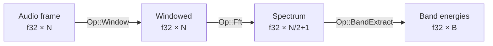

# Getting Started

## Prerequisites

- [Nix](https://nixos.org/download.html) with flakes enabled
- NVIDIA GPU with installed driver (kernel module) — **required only for the CUDA backend**

## Environment Setup

All commands must be run inside the Nix development shell:

```bash
nix develop
```

The shell hook automatically sets:
- `CUDA_PATH` — path to CUDA toolkit (headers, nvcc, stub libraries)
- `NVRTC_PATH` — path to NVRTC runtime compilation library
- `RUSTFLAGS` — rpaths for linking against host NVIDIA driver libraries

## Build

```bash
nix develop --command cargo build              # Debug build
nix develop --command cargo build --release    # Release build
```

## Compile the CUDA Kernel (optional)

Only needed if you use the CUDA backend or run the demo binary:

```bash
nix develop --command ./backends-cuda/compile-kernel.sh
```

This compiles `backends-cuda/kernel.cu` into `kernel.ptx` using `nvcc`. The
script requires the Nix shell environment variables (`NVCC_WRAPPED`,
`NVCC_HOST_COMPILER`, `NVCC_EXTRA_FLAGS`).

## Run the Demo

```bash
nix develop --command cargo run --bin demo
```

Expected output:

```
Input:  [3, 7, 1, 9, 4, 6, 2, 8, 5, 10]
Output: [6, 14, 2, 18, 8, 12, 4, 16, 10, 20]
```

The demo loads `kernel.ptx`, creates a CUDA backend on device 0, and runs a
kernel that doubles each integer element.

## Run Tests

```bash
nix develop --command cargo test                # Run all tests
nix develop --command cargo test <name>         # Run tests matching <name>
nix develop --command cargo tarpaulin           # Code coverage report
```

## Lint and Format

```bash
nix develop --command cargo clippy              # Lint checks
nix develop --command cargo fmt                 # Format code
nix develop --command cargo fmt --check         # Check formatting without writing
nix develop --command cargo deny check          # License, advisory, and ban checks
```

## Workspace Structure

```
graphynx/
├── core/                   # graph-core — Op catalog · Graph IR · TensorType · Shape · DType
├── backends/               # backends — Backend trait · BackendError · DeviceId
├── backends-cpu/           # backends-cpu — CpuBackend (signal ops: Window · FFT · BandExtract)
├── backends-cuda/          # backends-cuda — CudaBackend (PTX kernels)
│   ├── kernel.cu           # CUDA C kernel source
│   └── compile-kernel.sh   # PTX compilation script
└── runtime/                # runtime — Executor · demo binary
    └── src/executor/       # scheduler · buffer arena · handles · state
```

## Using as a Library

Add the crates you need to your `Cargo.toml`:

```toml
[dependencies]
graph-core    = { path = "../path/to/graphynx/core" }
backends      = { path = "../path/to/graphynx/backends" }
backends-cpu  = { path = "../path/to/graphynx/backends-cpu" }
runtime       = { path = "../path/to/graphynx/runtime" }
```

### Building a signal processing graph



```rust
use graph_core::{
    graph::GraphBuilder,
    ops::{
        Op,
        signal::{WindowKind, WindowParams, FftDirection, FftOutput, FftParams,
                 BandDef, BandExtractParams},
    },
    types::{DType, TensorType},
};
use backends::{Backend, DeviceId};
use backends_cpu::CpuBackend;
use runtime::executor::Executor;

let n: usize = 1024;
let sr: f32 = 44_100.0;
let cpu = DeviceId::new("cpu:0");

let mut b = GraphBuilder::new();

let audio_src = b.add_source("audio", TensorType::vector(DType::F32, n).unwrap());

let win_node = b.add_op_node(
    Op::Window(WindowParams::new(WindowKind::Hann, n).unwrap()),
    cpu.clone(),
    vec![TensorType::vector(DType::F32, n).unwrap()],
);

let fft_node = b.add_op_node(
    Op::Fft(FftParams::new(n, FftDirection::Forward, FftOutput::MagnitudeOneSided).unwrap()),
    cpu.clone(),
    vec![TensorType::vector(DType::F32, n / 2 + 1).unwrap()],
);

let bands = vec![
    BandDef::new(20.0,    250.0,  "low").unwrap(),
    BandDef::new(250.0,   4000.0, "mid").unwrap(),
    BandDef::new(4000.0, 20000.0, "high").unwrap(),
];
let band_node = b.add_op_node(
    Op::BandExtract(BandExtractParams::new(bands, sr, 0.6).unwrap()),
    cpu.clone(),
    vec![TensorType::vector(DType::F32, 3).unwrap()],
);

b.add_edge(audio_src, win_node,  0);
b.add_edge(win_node,  fft_node,  0);
b.add_edge(fft_node,  band_node, 0);
b.add_sink("energies", band_node, 0);

let graph = b.build().unwrap();
let backend: Box<dyn Backend> = Box::new(CpuBackend::new(cpu));
let mut exec = Executor::new(graph, vec![backend]).unwrap();

// Run one frame
let samples = vec![0.0_f32; n];
exec.input("audio").unwrap().write("audio", bytemuck::cast_slice(&samples)).unwrap();
exec.run().unwrap();
let energies: &[f32] = exec.output("energies").unwrap().read().unwrap();
println!("Band energies: {:?}", energies);
```

### Describing tensor types for graph edges

```rust
use graph_core::types::{Dim, Layout, TensorType, DType};
use backends::DeviceId;

// Common shapes use the short constructors:
let scalar = TensorType::scalar(DType::F32);
let vector = TensorType::vector(DType::F32, 1024).unwrap();
let matrix = TensorType::matrix(DType::F64, 512, 512).unwrap();

// Complex shapes use the builder:
let image = TensorType::builder(DType::F32)
    .shape(vec![
        Dim::Symbolic("batch".into()),
        Dim::Fixed(3),
        Dim::Fixed(224),
        Dim::Fixed(224),
    ])
    .layout(Layout::NCHW)
    .dim_names(vec![
        "batch".into(), "channels".into(), "height".into(), "width".into(),
    ])
    .device(DeviceId::new("cuda:0"))
    .build()
    .unwrap();

println!("{}", image); // f32[batch, 3, 224, 224] NCHW @ cuda:0
```

### Describing ML operations

```rust
use graph_core::ops::{Op, ml::{Conv2dParams, SoftmaxParams}};

// Parameterless activations
let relu = Op::Relu;
println!("{}", relu); // "Relu"

// Convolution — using the safe constructor
let conv = Op::Conv2d(Conv2dParams::new(
    [3, 3],   // kernel_size
    [1, 1],   // stride
    [1, 1],   // padding
    [1, 1],   // dilation
    1,        // groups
).unwrap());
assert!(conv.is_spatial_2d());

// Custom op — using the safe constructor
let custom = Op::custom("my_fused_op", vec![/* backend-specific bytes */]).unwrap();
assert!(custom.is_custom());
```

## Rust Toolchain

The Rust toolchain is pinned in `rust-toolchain.toml` to `stable 1.94.1`. Do
not change this without following the upgrade procedure documented in `AGENTS.md`.

## Further Reading

- [Architecture Overview](architecture.md) — layered design, data flow, and design principles
- [Executor Guide](executor.md) — how the executor schedules and dispatches nodes
- [Signal Ops Guide](signal-ops.md) — Window, FFT, BandExtract algorithms and graph wiring
- [Graph IR](graph-ir.md) — GraphBuilder API and graph validation
- [Backend Trait System](backend-trait.md) — `Backend`, `DeviceBuffer`, `KernelDescriptor`
- [CUDA Backend](cuda-backend.md) — CUDA-specific implementation details
- [Op Catalog](op-catalog.md) — `Op` enum, all parameter structs, query methods
- [DType](dtype.md) — scalar element type system
- [Shape Module](shape.md) — validated tensor shapes, broadcasting, reshape, strides
- [Tensor Type System](tensor-type.md) — `Dim`, `Layout`, `TensorType`, construction, compatibility
- [ARCHITECTURE.md](../ARCHITECTURE.md) — full long-term design plan
