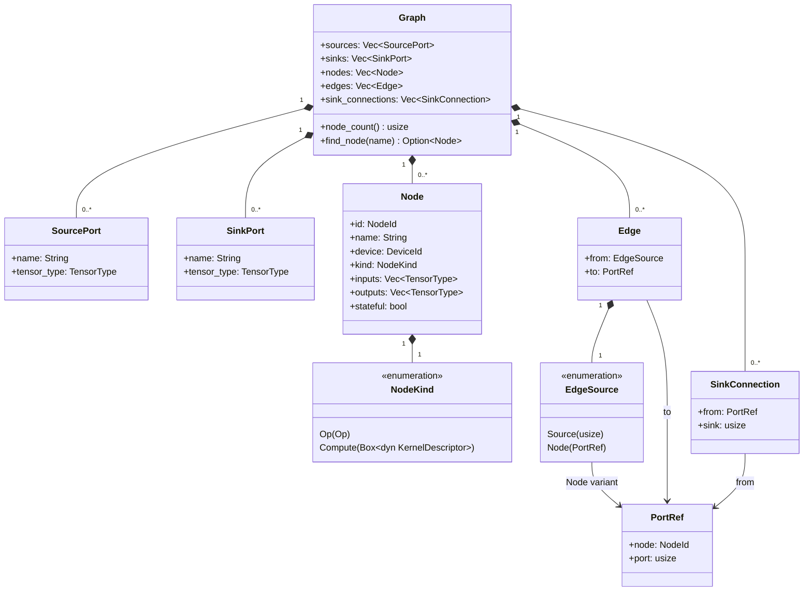
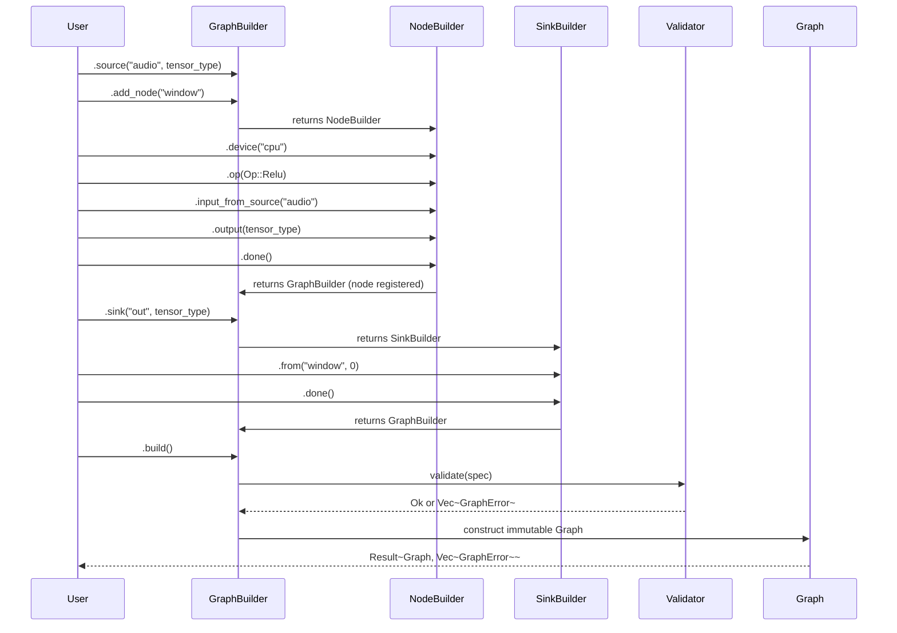
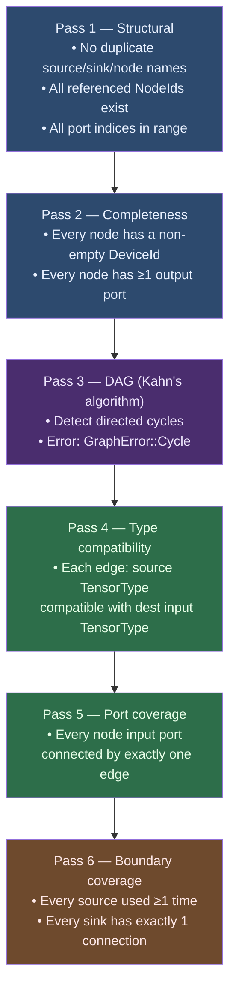

# Graph IR — Developer Guide

The `graph-core::graph` module implements the **Graph IR**: an immutable,
validated directed acyclic computation graph. A graph represents a typed
function:

```
(Source₁, Source₂, …) → (Sink₁, Sink₂, …)
```

Nodes hold computation (an [`Op`] or a raw [`KernelDescriptor`]). Edges carry
typed tensor data between nodes and boundary ports. The graph is constructed
via a fluent builder and validated at build time — all errors are returned
together so you can fix multiple issues in one round.

---

## Data model



---

## Builder flow



---

## Validation passes

Six passes run in order at `.build()` time. All errors from all passes are
collected and returned together.



> **Note**: Passes 3–6 only run if passes 1–2 are clean, to avoid misleading
> errors from broken references.

---

## Quick start

```rust
use graph_core::graph::GraphBuilder;
use graph_core::ops::Op;
use graph_core::types::{dim::Dim, DType, Layout, TensorType};

// Declare a tensor type for all ports in this example.
let t = TensorType::new(
    DType::F32,
    vec![Dim::Fixed(1), Dim::Fixed(1024)],
    Layout::RowMajor,
).unwrap();

// Build a two-node linear graph:
//   source("audio") → relu → add → sink("out")
let graph = GraphBuilder::new()
    .source("audio", t.clone())
    // First node: Relu
    .add_node("relu")
        .device("cpu")
        .op(Op::Relu)
        .input_from_source("audio")
        .output(t.clone())
        .done()
    // Second node: Add (two inputs — same source fed twice for illustration)
    .add_node("add")
        .device("cpu")
        .op(Op::Add)
        .input_from("relu", 0)
        .input_from("relu", 0)
        .output(t.clone())
        .done()
    // Output boundary
    .sink("out", t.clone())
        .from("add", 0)
        .done()
    .build()
    .unwrap();

assert_eq!(graph.node_count(), 2);
assert_eq!(graph.sources()[0].name, "audio");
assert_eq!(graph.sinks()[0].name, "out");
```

---

## Using a raw kernel descriptor

```rust
use std::any::Any;
use graph_core::graph::{GraphBuilder, KernelDescriptor};
use graph_core::types::{dim::Dim, DType, Layout, TensorType};

struct MyPtxKernel {
    pub ptx: String,
    pub entry: String,
}

impl KernelDescriptor for MyPtxKernel {
    fn as_any(&self) -> &dyn Any { self }
}

let t = TensorType::new(DType::F32, vec![Dim::Fixed(256)], Layout::RowMajor).unwrap();

let graph = GraphBuilder::new()
    .source("in", t.clone())
    .add_node("custom_kernel")
        .device("cuda:0")
        .compute(Box::new(MyPtxKernel {
            ptx: include_str!("../kernel.ptx").to_string(),
            entry: "my_fn".to_string(),
        }))
        .input_from_source("in")
        .output(t.clone())
        .done()
    .sink("out", t.clone())
        .from("custom_kernel", 0)
        .done()
    .build()
    .unwrap();
```

---

## Error handling

`build()` returns `Result<Graph, Vec<GraphError>>`. Every error variant is
`Clone + PartialEq` so you can pattern-match or collect them:

```rust
match graph_builder.build() {
    Ok(graph) => { /* use graph */ }
    Err(errors) => {
        for err in &errors {
            eprintln!("Graph error: {err}");
        }
        // fix issues and retry
    }
}
```

### Error variants

| Variant | When |
|---------|------|
| `Cycle` | A directed cycle exists in the node graph |
| `TypeMismatch` | Source and destination tensor types are incompatible |
| `UnconnectedPort` | A node input port has no incoming edge |
| `UnconnectedSink` | A sink has no connection from any node output |
| `UnusedSource` | A declared source is never referenced by any edge |
| `EmptyDevice` | A node's device ID is the empty string |
| `DuplicateNodeName` | Two nodes share the same name |
| `DuplicateSourceName` | Two sources share the same name |
| `DuplicateSinkName` | Two sinks share the same name |
| `UnknownSource` | An edge references a source name that was never declared |
| `UnknownNode` | An edge references a node that was never declared |
| `PortOutOfRange` | An edge or sink connection references a port index that is out of range |
| `NoOutputs` | A node declares no output ports |

---

## Design notes

### Graph immutability

A `Graph` is immutable after `build()`. All accessors return `&[T]` slices.
There is no way to add or remove nodes after construction. This is intentional:
the graph is a pure description of computation, not a mutable execution state.
Execution state (device handles, buffer allocations) lives in the executor
(Phase 2).

### Error accumulation

The builder accumulates intent without validating it. All validation happens
at `build()` time and all errors are returned at once. This means you can fix
multiple issues in a single round rather than discovering them one by one.

### KernelDescriptor

`KernelDescriptor` is defined in `graph-core` (not in `backends`) because the
graph IR must remain backend-agnostic. The `backends` crate re-exports it for
backward compatibility. Each backend downcasts `&dyn KernelDescriptor` to its
own concrete type inside `dispatch_compute`.

### Source/Sink as boundary ports

Sources and sinks are explicit boundary ports rather than special `NodeKind`
variants. This keeps `Node` uniform (every node has inputs and outputs) and
makes the graph's external interface explicit and queryable. The executor maps
sources to host input tensors and sinks to host output tensors.

### Type compatibility

Edge type checking uses `TensorType::is_compatible_with`, which allows
`Layout::Any` to match any layout and `Dim::Dynamic`/`Dim::Symbolic` to match
fixed dimensions. See [`tensor-type.md`](tensor-type.md) for the full
compatibility rules.

---

## Related documentation

- [`op-catalog.md`](op-catalog.md) — The `Op` enum and all primitive operations
- [`tensor-type.md`](tensor-type.md) — `TensorType`, `DType`, `Shape`, `Layout`
- [`backend-trait.md`](backend-trait.md) — The `Backend` trait and `KernelDescriptor`
- [`voice-metaballs-plan.md`](voice-metaballs-plan.md) — Overall project plan
