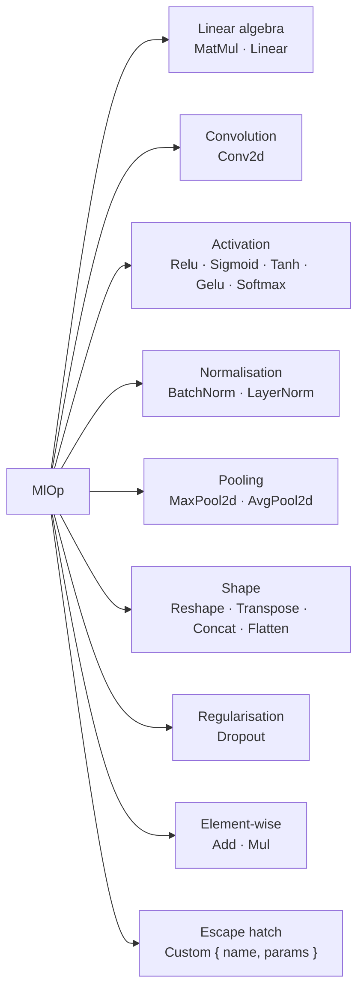

# ML Op Catalog

The `ml_op` module (`src/ml_op.rs`) provides a curated catalog of primitive ML operations and their parameter structs. It has no GPU SDK dependencies and is 100% safe Rust.

## Overview

`MlOp` is the vocabulary the engine uses to describe computation at nodes. Multiple backends can implement the same `MlOp`, allowing the executor to route an operation to whichever backend targets the node's device.



## `MlOp` Enum

### Linear algebra

| Variant | Params struct | Description |
|---|---|---|
| `MatMul(MatMulParams)` | `transpose_a`, `transpose_b` | `C = op(A) · op(B)` |
| `Linear(LinearParams)` | `in_features`, `out_features`, `bias` | Fully-connected layer `y = x W^T + b` |

### Convolution

| Variant | Params struct | Description |
|---|---|---|
| `Conv2d(Conv2dParams)` | `kernel_size`, `stride`, `padding`, `dilation`, `groups` | 2-D spatial convolution |

### Activation

| Variant | Params struct | Description |
|---|---|---|
| `Relu` | — | `max(0, x)` |
| `Sigmoid` | — | `1 / (1 + exp(-x))` |
| `Tanh` | — | Hyperbolic tangent |
| `Gelu` | — | Gaussian error linear unit |
| `Softmax(SoftmaxParams)` | `axis` | Softmax along an axis |

### Normalisation

| Variant | Params struct | Description |
|---|---|---|
| `BatchNorm(BatchNormParams)` | `num_features`, `eps`, `momentum` | Batch normalisation |
| `LayerNorm(LayerNormParams)` | `normalized_shape`, `eps` | Layer normalisation |

### Pooling

| Variant | Params struct | Description |
|---|---|---|
| `MaxPool2d(PoolParams)` | `kernel_size`, `stride`, `padding` | 2-D max pooling |
| `AvgPool2d(PoolParams)` | `kernel_size`, `stride`, `padding` | 2-D average pooling |

### Shape manipulation

| Variant | Params struct | Description |
|---|---|---|
| `Reshape(ReshapeParams)` | `target_shape: Vec<Dim>` | Change shape, preserve element count |
| `Transpose(TransposeParams)` | `perm: Vec<usize>` | Permute axes |
| `Concat(ConcatParams)` | `axis: i32` | Concatenate tensors along an axis |
| `Flatten(FlattenParams)` | `start_dim`, `end_dim` | Flatten a range of axes into one |

### Regularisation

| Variant | Params struct | Description |
|---|---|---|
| `Dropout(DropoutParams)` | `p: f64` | Zero elements with probability `p` during training |

### Element-wise arithmetic

| Variant | Params struct | Description |
|---|---|---|
| `Add` | — | Element-wise addition |
| `Mul` | — | Element-wise multiplication |

### Escape hatch

| Variant | Fields | Description |
|---|---|---|
| `Custom { name, params }` | `name: String`, `params: Vec<u8>` | Any operation not in the catalog |

`name` is a backend-interpreted identifier. `params` carries serialised operation parameters in any format the backend expects (JSON, protobuf, raw bytes, etc.).

## Query Methods

| Method | Returns | Description |
|---|---|---|
| `name()` | `&str` | Human-readable operation name. For `Custom`, returns the user-supplied `name`. |
| `is_parameterless()` | `bool` | `true` for `Relu`, `Sigmoid`, `Tanh`, `Gelu`, `Add`, `Mul`. |
| `is_custom()` | `bool` | `true` for `Custom { .. }`. |
| `is_spatial_2d()` | `bool` | `true` for `Conv2d`, `MaxPool2d`, `AvgPool2d` — operations that require a 4-D input. |

## `Display`

`MlOp` formats as its name string:

```
Relu         → "Relu"
Conv2d(…)    → "Conv2d"
Custom{…}    → "<user-supplied name>"
```

## Param Structs Reference

### `Conv2dParams`

```rust
pub struct Conv2dParams {
    pub kernel_size: [usize; 2],   // [kh, kw]
    pub stride:      [usize; 2],   // [sh, sw]
    pub padding:     [usize; 2],   // [ph, pw]
    pub dilation:    [usize; 2],   // [dh, dw]
    pub groups:      usize,
}
```

All spatial parameters are `[height, width]` ordered. `groups = 1` is a standard convolution; `groups = in_channels` gives a depth-wise convolution.

### `MatMulParams`

```rust
pub struct MatMulParams {
    pub transpose_a: bool,
    pub transpose_b: bool,
}
```

### `LinearParams`

```rust
pub struct LinearParams {
    pub in_features:  usize,
    pub out_features: usize,
    pub bias:         bool,
}
```

### `PoolParams`

Shared by `MaxPool2d` and `AvgPool2d`:

```rust
pub struct PoolParams {
    pub kernel_size: [usize; 2],
    pub stride:      [usize; 2],
    pub padding:     [usize; 2],
}
```

### `BatchNormParams`

```rust
pub struct BatchNormParams {
    pub num_features: usize,
    pub eps:          f64,
    /// None = cumulative moving average. Some(0.1) is a common default.
    pub momentum:     Option<f64>,
}
```

### `LayerNormParams`

```rust
pub struct LayerNormParams {
    pub normalized_shape: Vec<usize>,
    pub eps:              f64,
}
```

### `SoftmaxParams`

```rust
pub struct SoftmaxParams {
    pub axis: i32,   // negative values index from the end
}
```

### `ReshapeParams`

```rust
pub struct ReshapeParams {
    pub target_shape: Vec<Dim>,  // may contain Dynamic/Symbolic dims
}
```

### `TransposeParams`

```rust
pub struct TransposeParams {
    pub perm: Vec<usize>,   // must be a permutation of 0..rank
}
```

### `ConcatParams`

```rust
pub struct ConcatParams {
    pub axis: i32,   // negative values index from the end
}
```

### `FlattenParams`

```rust
pub struct FlattenParams {
    pub start_dim: i32,   // inclusive
    pub end_dim:   i32,   // inclusive; -1 means last dim
}
```

### `DropoutParams`

```rust
pub struct DropoutParams {
    pub p: f64,   // probability in [0.0, 1.0)
}
```

## Usage Examples

```rust
use graphynx::ml_op::{
    MlOp, Conv2dParams, LinearParams, MatMulParams,
    SoftmaxParams, BatchNormParams, PoolParams,
};

// Standard 3×3 convolution
let conv = MlOp::Conv2d(Conv2dParams {
    kernel_size: [3, 3],
    stride:      [1, 1],
    padding:     [1, 1],
    dilation:    [1, 1],
    groups:      1,
});
assert_eq!(conv.name(), "Conv2d");
assert!(conv.is_spatial_2d());

// Parameterless activations
let relu = MlOp::Relu;
assert!(relu.is_parameterless());
println!("{}", relu); // "Relu"

// Fully-connected layer
let fc = MlOp::Linear(LinearParams {
    in_features:  1024,
    out_features: 256,
    bias:         true,
});
assert_eq!(fc.name(), "Linear");

// Custom operation with serialised parameters
let custom = MlOp::Custom {
    name:   "my_fused_op".to_string(),
    params: serde_json::to_vec(&config)?,
};
assert!(custom.is_custom());
```

## Extension Pattern

When a backend receives a node with a `Custom` op, it should inspect `name` and deserialise `params`:

```rust
fn dispatch_ml_op(&self, op: &MlOp, ...) -> Result<(), BackendError> {
    match op {
        MlOp::Relu    => { /* element-wise max(0, x) */ }
        MlOp::Conv2d(p) => { /* cuDNN conv forward */ }
        MlOp::Custom { name, params } if name == "my_fused_op" => {
            let config: MyOpConfig = serde_json::from_slice(params)
                .map_err(|e| BackendError::InvalidKernel(e.to_string()))?;
            // ... execute fused op
        }
        _ => return Err(BackendError::UnsupportedOp),
    }
    Ok(())
}
```

## Further Reading

- [Tensor Type System](tensor-type.md) — `TensorType`, `Dim`, `Layout` used in `ReshapeParams`
- [Backend Trait System](backend-trait.md) — `dispatch_ml_op` and `dispatch_ml_model`
- [Architecture Overview](architecture.md) — where `MlOp` sits in the layered design
- [ARCHITECTURE.md](../ARCHITECTURE.md) — full long-term plan including the Graph IR that hosts `MlOp` nodes
