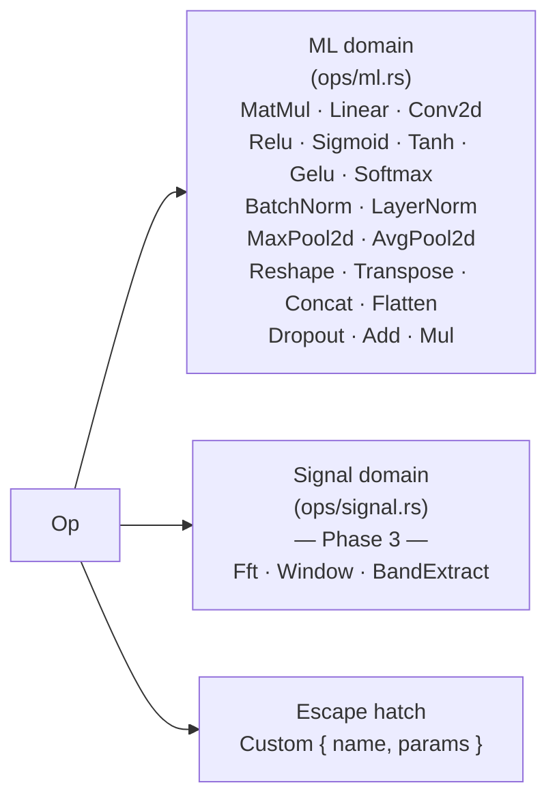
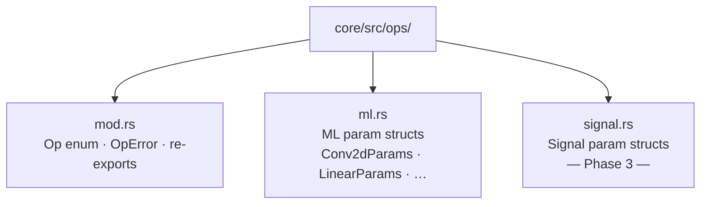

# Op Catalog

> **Migration note:** `MlOp` was renamed to `Op` and `MlOpError` to `OpError`
> in Phase 0 of the voice-reactive metaballs project. See
> `docs/voice-metaballs-plan.md` for the full rationale.

The `ops` module (`core/src/ops/`) provides a curated catalog of primitive
operations and their parameter structs. It has no GPU SDK dependencies and is
100% safe Rust.

## Overview

`Op` is the vocabulary the engine uses to describe computation at nodes.
Multiple backends can implement the same `Op`, allowing the executor to route
an operation to whichever backend targets the node's device. The catalog is
domain-agnostic: ML operations live in `ops/ml.rs`, signal-processing
operations will live in `ops/signal.rs` (Phase 3), and future domains follow
the same pattern.



## `OpError`

Errors produced when constructing operation parameters through safe
constructors. Every variant carries enough context for the caller to understand
exactly what invariant was violated.

```mermaid
graph TD
    OpError --> ZeroSpatialParam["ZeroSpatialParam { param }<br/>kernel_size, stride, or dilation was 0"]
    OpError --> ZeroGroups["ZeroGroups<br/>groups was 0"]
    OpError --> ZeroFeatures["ZeroFeatures { param }<br/>in_features or out_features was 0"]
    OpError --> ZeroNumFeatures["ZeroNumFeatures<br/>num_features was 0"]
    OpError --> NonPositiveEps["NonPositiveEps(f64)<br/>eps was ≤ 0"]
    OpError --> InvalidMomentum["InvalidMomentum(f64)<br/>momentum outside [0.0, 1.0)"]
    OpError --> InvalidDropoutP["InvalidDropoutP(f64)<br/>p outside [0.0, 1.0)"]
    OpError --> InvalidNormalizedShape["InvalidNormalizedShape<br/>empty or contains zeros"]
    OpError --> InvalidPermutation["InvalidPermutation { perm, expected_len }<br/>not a permutation of 0..rank"]
    OpError --> EmptyCustomName["EmptyCustomName<br/>Custom op name was empty"]
```



Derives: `Debug`, `Error`, `Clone`, `PartialEq`.

## `Op` Enum

### ML domain (`ops/ml.rs`)

#### Linear algebra

| Variant | Params struct | Description |
|---|---|---|
| `MatMul(MatMulParams)` | `transpose_a`, `transpose_b` | `C = op(A) · op(B)` |
| `Linear(LinearParams)` | `in_features`, `out_features`, `bias` | Fully-connected layer `y = x W^T + b` |

#### Convolution

| Variant | Params struct | Description |
|---|---|---|
| `Conv2d(Conv2dParams)` | `kernel_size`, `stride`, `padding`, `dilation`, `groups` | 2-D spatial convolution |

#### Activation

| Variant | Params struct | Description |
|---|---|---|
| `Relu` | — | `max(0, x)` |
| `Sigmoid` | — | `1 / (1 + exp(-x))` |
| `Tanh` | — | Hyperbolic tangent |
| `Gelu` | — | Gaussian error linear unit |
| `Softmax(SoftmaxParams)` | `axis` | Softmax along an axis |

#### Normalisation

| Variant | Params struct | Description |
|---|---|---|
| `BatchNorm(BatchNormParams)` | `num_features`, `eps`, `momentum` | Batch normalisation |
| `LayerNorm(LayerNormParams)` | `normalized_shape`, `eps` | Layer normalisation |

#### Pooling

| Variant | Params struct | Description |
|---|---|---|
| `MaxPool2d(PoolParams)` | `kernel_size`, `stride`, `padding` | 2-D max pooling |
| `AvgPool2d(PoolParams)` | `kernel_size`, `stride`, `padding` | 2-D average pooling |

#### Shape manipulation

| Variant | Params struct | Description |
|---|---|---|
| `Reshape(ReshapeParams)` | `target_shape: Shape` | Change shape, preserve element count |
| `Transpose(TransposeParams)` | `perm: Vec<usize>` | Permute axes |
| `Concat(ConcatParams)` | `axis: i32` | Concatenate tensors along an axis |
| `Flatten(FlattenParams)` | `start_dim`, `end_dim` | Flatten a range of axes into one |

#### Regularisation

| Variant | Params struct | Description |
|---|---|---|
| `Dropout(DropoutParams)` | `p: f64` | Zero elements with probability `p` during training |

#### Element-wise arithmetic

| Variant | Params struct | Description |
|---|---|---|
| `Add` | — | Element-wise addition |
| `Mul` | — | Element-wise multiplication |

### Signal domain (`ops/signal.rs`) — Phase 3

Signal processing variants (`Fft`, `Window`, `BandExtract`) will be added in
Phase 3. See `docs/voice-metaballs-plan.md` for the planned parameter structs.

### Escape hatch

| Variant | Fields | Description |
|---|---|---|
| `Custom { name, params }` | `name: String`, `params: Vec<u8>` | Any operation not in the catalog |

`name` is a backend-interpreted identifier. `params` carries serialised
operation parameters in any format the backend expects (JSON, protobuf, raw
bytes, etc.).

Use `Op::custom(name, params)` for validated construction — it rejects empty
names. Direct construction via `Op::Custom { name, params }` is also possible
but does not validate.

## Query Methods

| Method | Returns | Description |
|---|---|---|
| `name()` | `&str` | Human-readable operation name. For `Custom`, returns the user-supplied `name`. |
| `is_parameterless()` | `bool` | `true` for `Relu`, `Sigmoid`, `Tanh`, `Gelu`, `Add`, `Mul`. |
| `is_custom()` | `bool` | `true` for `Custom { .. }`. |
| `is_spatial_2d()` | `bool` | `true` for `Conv2d`, `MaxPool2d`, `AvgPool2d` — operations that require a 4-D input. |

## `Display`

`Op` formats as its name string:

```
Relu         → "Relu"
Conv2d(…)    → "Conv2d"
Custom{…}    → "<user-supplied name>"
```

## Param Structs Reference

All param structs with non-trivial invariants provide a `new()` safe
constructor that returns `Result<Self, OpError>`. Direct struct construction is
also possible but bypasses validation.

### `Conv2dParams`

```rust
pub struct Conv2dParams {
    pub kernel_size: [usize; 2],   // [kh, kw]
    pub stride:      [usize; 2],   // [sh, sw]
    pub padding:     [usize; 2],   // [ph, pw]
    pub dilation:    [usize; 2],   // [dh, dw]
    pub groups:      usize,
}
```

All spatial parameters are `[height, width]` ordered. `groups = 1` is a
standard convolution; `groups = in_channels` gives a depth-wise convolution.

**`Conv2dParams::new(kernel_size, stride, padding, dilation, groups)`** —
Returns `Err` if `kernel_size`, `stride`, or `dilation` contain zeros, or if
`groups == 0`.

### `MatMulParams`

```rust
pub struct MatMulParams {
    pub transpose_a: bool,
    pub transpose_b: bool,
}
```

**`MatMulParams::new(transpose_a, transpose_b)`** — Infallible constructor.

### `LinearParams`

```rust
pub struct LinearParams {
    pub in_features:  usize,
    pub out_features: usize,
    pub bias:         bool,
}
```

**`LinearParams::new(in_features, out_features, bias)`** — Returns
`Err(OpError::ZeroFeatures)` if either feature count is 0.

### `PoolParams`

Shared by `MaxPool2d` and `AvgPool2d`:

```rust
pub struct PoolParams {
    pub kernel_size: [usize; 2],
    pub stride:      [usize; 2],
    pub padding:     [usize; 2],
}
```

**`PoolParams::new(kernel_size, stride, padding)`** — Returns `Err` if
`kernel_size` or `stride` contain zeros.

### `BatchNormParams`

```rust
pub struct BatchNormParams {
    pub num_features: usize,
    pub eps:          f64,
    /// None = cumulative moving average. Some(0.1) is a common default.
    pub momentum:     Option<f64>,
}
```

**`BatchNormParams::new(num_features, eps, momentum)`** — Returns `Err` if
`num_features == 0`, `eps <= 0`, or `momentum` is outside `[0.0, 1.0)`.

### `LayerNormParams`

```rust
pub struct LayerNormParams {
    pub normalized_shape: Vec<usize>,
    pub eps:              f64,
}
```

**`LayerNormParams::new(normalized_shape, eps)`** — Returns `Err` if
`normalized_shape` is empty, contains zeros, or `eps <= 0`.

### `SoftmaxParams`

```rust
pub struct SoftmaxParams {
    pub axis: i32,   // negative values index from the end
}
```

**`SoftmaxParams::new(axis)`** — Infallible constructor.

### `ReshapeParams`

```rust
pub struct ReshapeParams {
    pub target_shape: Shape,  // validated Shape (see shape.md)
}
```

`ReshapeParams::new(shape)` takes a pre-validated [`Shape`](shape.md) and is
infallible.

### `TransposeParams`

```rust
pub struct TransposeParams {
    pub perm: Vec<usize>,   // must be a permutation of 0..rank
}
```

**`TransposeParams::new(perm)`** — Returns `Err(OpError::InvalidPermutation)`
if `perm` is empty or is not a valid permutation of `0..perm.len()`.

### `ConcatParams`

```rust
pub struct ConcatParams {
    pub axis: i32,   // negative values index from the end
}
```

**`ConcatParams::new(axis)`** — Infallible constructor.

### `FlattenParams`

```rust
pub struct FlattenParams {
    pub start_dim: i32,   // inclusive
    pub end_dim:   i32,   // inclusive; -1 means last dim
}
```

**`FlattenParams::new(start_dim, end_dim)`** — Infallible constructor.

### `DropoutParams`

```rust
pub struct DropoutParams {
    pub p: f64,   // probability in [0.0, 1.0)
}
```

**`DropoutParams::new(p)`** — Returns `Err(OpError::InvalidDropoutP)` if `p`
is outside `[0.0, 1.0)`.

## Usage Examples

### Using safe constructors (recommended)

```rust
use graph_core::ops::{
    Op, Conv2dParams, LinearParams, MatMulParams,
    SoftmaxParams, BatchNormParams, PoolParams,
    DropoutParams, TransposeParams,
};

// Standard 3×3 convolution — validated constructor
let conv = Op::Conv2d(Conv2dParams::new(
    [3, 3],   // kernel_size
    [1, 1],   // stride
    [1, 1],   // padding
    [1, 1],   // dilation
    1,        // groups
).unwrap());
assert_eq!(conv.name(), "Conv2d");
assert!(conv.is_spatial_2d());

// Fully-connected layer — validated constructor
let fc = Op::Linear(LinearParams::new(1024, 256, true).unwrap());
assert_eq!(fc.name(), "Linear");

// Batch normalisation — validated constructor
let bn = Op::BatchNorm(BatchNormParams::new(64, 1e-5, Some(0.1)).unwrap());

// Transpose — validated permutation
let t = Op::Transpose(TransposeParams::new(vec![0, 2, 1]).unwrap());

// Dropout — validated probability
let drop = Op::Dropout(DropoutParams::new(0.5).unwrap());

// Parameterless activations (no constructor needed)
let relu = Op::Relu;
assert!(relu.is_parameterless());
println!("{}", relu); // "Relu"
```

### Using `Op::custom()` (safe constructor)

```rust
use graph_core::ops::Op;

// Safe custom op constructor — rejects empty names
let custom = Op::custom("my_fused_op", vec![/* serialised params */]).unwrap();
assert!(custom.is_custom());

// Empty name is rejected
assert!(Op::custom("", vec![]).is_err());
```

### Direct struct construction (unchecked)

```rust
use graph_core::ops::{Op, Conv2dParams};

// Direct construction bypasses validation — use only with known-good values
let conv = Op::Conv2d(Conv2dParams {
    kernel_size: [3, 3],
    stride:      [1, 1],
    padding:     [1, 1],
    dilation:    [1, 1],
    groups:      1,
});
```

### Validation errors

```rust
use graph_core::ops::ml::{Conv2dParams, LinearParams, DropoutParams};
use graph_core::ops::OpError;

// Zero kernel size is rejected
let err = Conv2dParams::new([0, 3], [1, 1], [0, 0], [1, 1], 1).unwrap_err();
assert!(matches!(err, OpError::ZeroSpatialParam { .. }));

// Zero features rejected
let err = LinearParams::new(0, 256, true).unwrap_err();
assert!(matches!(err, OpError::ZeroFeatures { .. }));

// Dropout p out of range
let err = DropoutParams::new(1.0).unwrap_err();
assert!(matches!(err, OpError::InvalidDropoutP(_)));
```

## Extension Pattern

When a backend receives a node with a `Custom` op, it should inspect `name`
and deserialise `params`:

```rust
use graph_core::ops::Op;
use backends::BackendError;

fn dispatch_op(&self, op: &Op, inputs: &[&[u8]], outputs: &mut [Vec<u8>]) -> Result<(), BackendError> {
    match op {
        Op::Relu    => { /* element-wise max(0, x) */ }
        Op::Conv2d(p) => { /* cuDNN conv forward */ }
        Op::Custom { name, params } if name == "my_fused_op" => {
            let config: MyOpConfig = serde_json::from_slice(params)
                .map_err(|e| BackendError::InvalidKernel(e.to_string()))?;
            // ... execute fused op
        }
        _ => return Err(BackendError::UnsupportedOp),
    }
    Ok(())
}
```

## Module Organisation



## Further Reading

- [Shape Module](shape.md) — `Shape` type used in `ReshapeParams`
- [Tensor Type System](tensor-type.md) — `TensorType`, `Dim`, `Layout`
- [Backend Trait System](backend-trait.md) — `dispatch_op` and `dispatch_ml_model`
- [Architecture Overview](architecture.md) — where `Op` sits in the layered design
- [ARCHITECTURE.md](../ARCHITECTURE.md) — full long-term plan including the Graph IR that hosts `Op` nodes
- [Voice-Reactive Metaballs Plan](voice-metaballs-plan.md) — the project that drove this refactoring
