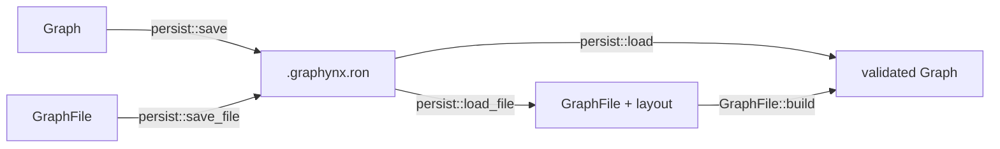
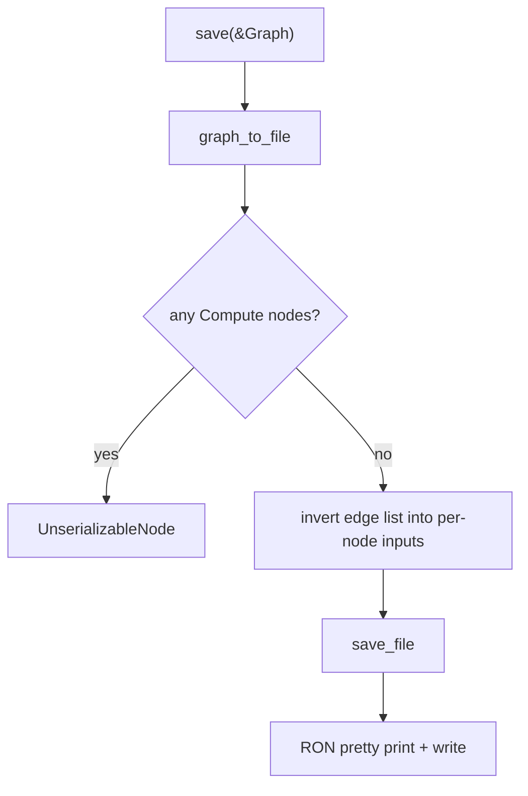
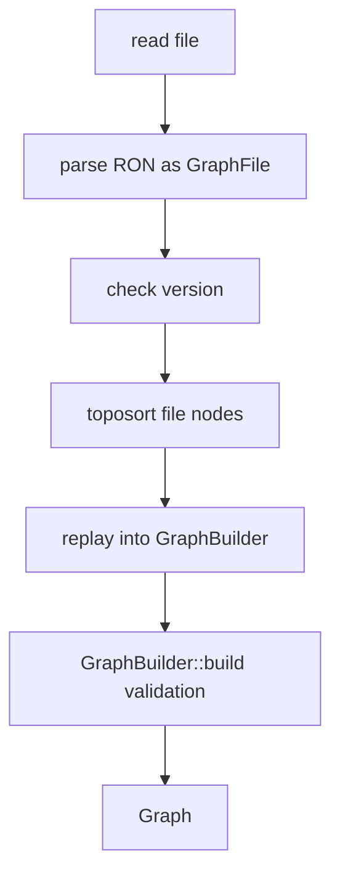
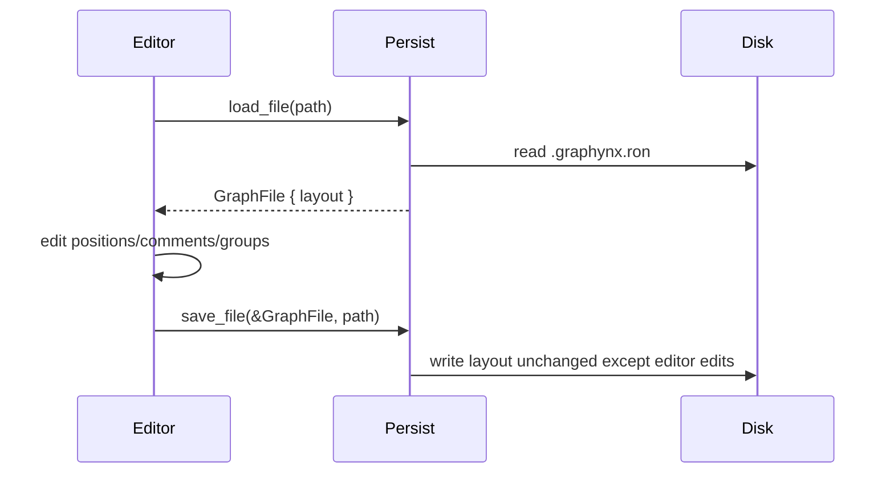
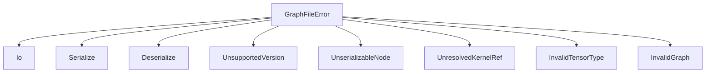

# Graph Persistence

Graph persistence is a `serde`-gated RON format for saving validated graphynx
graphs as `.graphynx.ron` files and loading them back through the normal
`GraphBuilder` validation path.

## API tiers



Use the executor tier (`save`/`load`) when you only need a runnable graph. Use
the editor tier (`save_file`/`load_file`) when a caller must preserve the opaque
`layout` metadata reserved for visual editors.

Enable the API with the `graph-core` `serde` feature:

```toml
graph-core = { path = "../graphynx/core", features = ["serde"] }
```

## File format

The current format version is `1`. Nodes are stored in a `BTreeMap`, so saved
files are deterministic and stable for git diffs.

```ron
GraphFile(
    version: 1,
    sources: [
        (name: "audio", tensor_type: (dtype: F32, shape: [Fixed(1024)], layout: RowMajor, dim_names: None)),
    ],
    nodes: {
        "window": (
            device: "cpu:0",
            op: Op(Window(kind: Hann, size: 1024)),
            inputs: [Source("audio")],
            outputs: [(dtype: F32, shape: [Fixed(1024)], layout: RowMajor, dim_names: None)],
            stateful: false,
        ),
    },
    sinks: [
        (name: "out", from_node: "window", from_port: 0, tensor_type: (dtype: F32, shape: [Fixed(1024)], layout: RowMajor, dim_names: None)),
    ],
)
```

## Type mapping

| Rust type | File representation | Notes |
|---|---|---|
| `Graph` | `GraphFile` | Runtime graph converted to serializable specs |
| `TensorType` | `TensorTypeSpec` | Rebuilt with validated constructors on load |
| `Shape` | `Vec<Dim>` | `Shape` itself uses serde `try_from`/`into` for op params |
| `NodeKind::Op` | `OpSpec::Op(Op)` | Fully serialized |
| `NodeKind::Compute` | unsupported by `save()` | Returns `GraphFileError::UnserializableNode` |
| editor layout | `Option<ron::Value>` | Opaque pass-through; never interpreted by runtime |

## Save path



## Load path



## Layout metadata



`persist::load(path)` discards layout by returning only `Graph`. `load_file`
returns the raw `GraphFile` so editors can preserve and mutate the metadata.

## Error handling



## Examples

Executor round-trip:

```rust
use graph_core::persist::{load, save};

# fn example(graph: &graph_core::graph::Graph) -> Result<(), graph_core::persist::GraphFileError> {
save(graph, "voice.graphynx.ron")?;
let loaded = load("voice.graphynx.ron")?;
assert_eq!(loaded.node_count(), graph.node_count());
# Ok(())
# }
```

Editor-preserving round-trip:

```rust
use graph_core::persist::{load_file, save_file};

# fn example() -> Result<(), graph_core::persist::GraphFileError> {
let mut file = load_file("voice.graphynx.ron")?;
file.layout = Some(ron::de::from_str(r#""editor-owned-layout""#)
    .map_err(|error| graph_core::persist::GraphFileError::Deserialize(error.to_string()))?);
save_file(&file, "voice.graphynx.ron")?;
# Ok(())
# }
```

## Round-trip guarantees

- `save → load → save` is deterministic for supported `Op` graphs.
- Loaded graphs are always validated through `GraphBuilder::build()`.
- Layout metadata is preserved by `load_file`/`save_file`, not by `load`.
- Raw `NodeKind::Compute` nodes are rejected until `KernelRef` registry support
  is added.

## Further reading

- [Graph IR](graph-ir.md)
- [Architecture overview](architecture.md)
- [DType](dtype.md)
