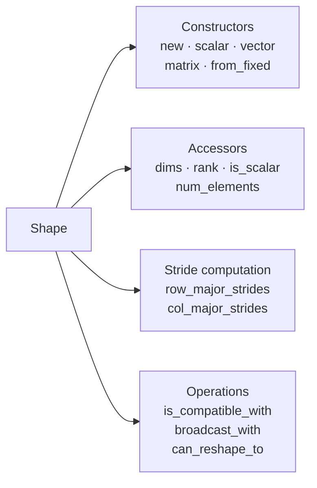
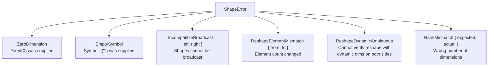
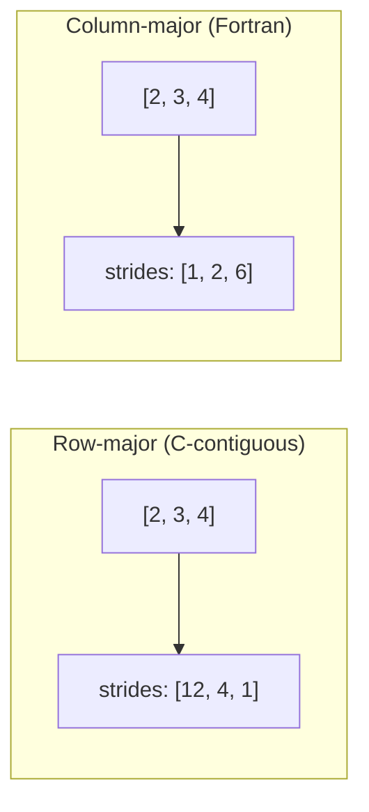
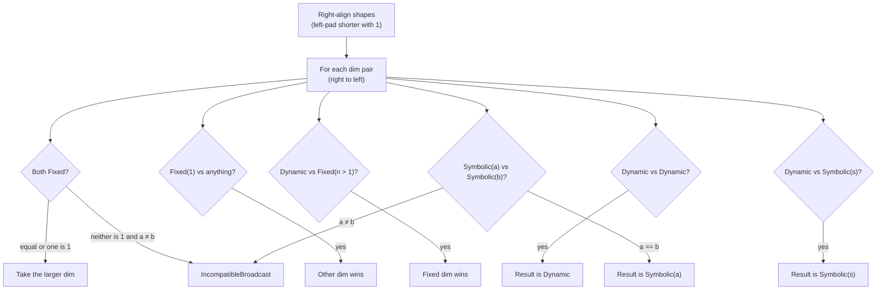

# Shape Module

The `shape` module (`src/shape/mod.rs` and `src/shape/ops.rs`) provides a validated tensor shape type with broadcasting, reshape validation, and stride computation. It is one component of the tensor type system; `Shape` is used inside [`TensorType`](tensor-type.md) to describe the dimensionality of tensors flowing along graph edges.

## Overview

A `Shape` is an ordered list of [`Dim`](tensor-type.md#dim)s with enforced invariants. All fields are private — construction goes through validated constructors that reject invalid states at the point of creation.



## Invariants

Every `Shape` instance satisfies:

- No `Dim::Fixed(0)` — all fixed dimensions must be >= 1.
- No `Dim::Symbolic("")` — symbolic names must be non-empty.

These invariants are checked in every constructor and cannot be bypassed because the `dims` field is private.

## `ShapeError`

Errors produced when constructing or transforming a `Shape`.



Derives: `Debug`, `Error`, `Clone`, `Eq`, `PartialEq`.

## Constructors

| Constructor | Parameters | Returns | Description |
|---|---|---|---|
| `Shape::new(dims)` | `Vec<Dim>` | `Result<Shape, ShapeError>` | General constructor, validates all dims |
| `Shape::scalar()` | — | `Shape` | Rank-0 shape (infallible) |
| `Shape::vector(len)` | `usize` | `Result<Shape, ShapeError>` | Rank-1 shape with one `Fixed` dim |
| `Shape::matrix(rows, cols)` | `usize, usize` | `Result<Shape, ShapeError>` | Rank-2 shape with two `Fixed` dims |
| `Shape::from_fixed(sizes)` | `&[usize]` | `Result<Shape, ShapeError>` | All dims as `Fixed`, from a `usize` slice |

### Examples

```rust
use graphynx::shape::Shape;
use graphynx::tensor_type::Dim;

// General constructor with mixed dim types
let s = Shape::new(vec![
    Dim::Symbolic("batch".into()),
    Dim::Fixed(3),
    Dim::Fixed(224),
    Dim::Fixed(224),
]).unwrap();

// Convenience constructors
let scalar = Shape::scalar();
let vector = Shape::vector(1024).unwrap();
let matrix = Shape::matrix(3, 4).unwrap();
let image  = Shape::from_fixed(&[1, 3, 224, 224]).unwrap();

// Validation rejects invalid dims
assert!(Shape::from_fixed(&[3, 0, 224]).is_err());  // ZeroDimension
assert!(Shape::new(vec![Dim::Symbolic("".into())]).is_err());  // EmptySymbol
```

## Accessors

| Method | Return type | Description |
|---|---|---|
| `dims()` | `&[Dim]` | The dimensions as a slice |
| `rank()` | `usize` | Number of dimensions (0 for scalars) |
| `is_scalar()` | `bool` | `true` for rank-0 shapes |
| `num_elements()` | `Option<usize>` | Product of all fixed dims; `None` if any dim is dynamic/symbolic; `Some(1)` for scalars |

## Stride Computation

`Shape` can compute element-level strides for both row-major and column-major layouts. Returns `None` if any dimension is not `Fixed`.



| Method | Description |
|---|---|
| `row_major_strides()` | Last dimension varies fastest. Returns `Option<Vec<usize>>`. |
| `col_major_strides()` | First dimension varies fastest. Returns `Option<Vec<usize>>`. |

### Examples

```rust
use graphynx::shape::Shape;

let s = Shape::from_fixed(&[2, 3, 4]).unwrap();
assert_eq!(s.row_major_strides(), Some(vec![12, 4, 1]));
assert_eq!(s.col_major_strides(), Some(vec![1, 2, 6]));

// Scalars return empty strides
assert_eq!(Shape::scalar().row_major_strides(), Some(vec![]));

// Dynamic shapes return None
use graphynx::tensor_type::Dim;
let d = Shape::new(vec![Dim::Dynamic, Dim::Fixed(8)]).unwrap();
assert_eq!(d.row_major_strides(), None);
```

## Broadcasting

`Shape::broadcast_with` implements NumPy-style broadcasting rules.



### Examples

```rust
use graphynx::shape::Shape;

// Standard broadcasting
let a = Shape::from_fixed(&[4, 1, 3]).unwrap();
let b = Shape::from_fixed(&[5, 3]).unwrap();
let c = a.broadcast_with(&b).unwrap();
assert_eq!(c, Shape::from_fixed(&[4, 5, 3]).unwrap());

// Scalar broadcasts with anything
let s = Shape::scalar();
let v = Shape::from_fixed(&[3, 4]).unwrap();
assert_eq!(s.broadcast_with(&v).unwrap(), v);

// Incompatible shapes produce an error
let x = Shape::from_fixed(&[3]).unwrap();
let y = Shape::from_fixed(&[4]).unwrap();
assert!(x.broadcast_with(&y).is_err());
```

## Compatibility

`Shape::is_compatible_with` checks whether two shapes have the same rank and each dimension pair is compatible (same semantics as [`Dim::is_compatible_with`](tensor-type.md#dim)).

```rust
use graphynx::shape::Shape;
use graphynx::tensor_type::Dim;

let a = Shape::from_fixed(&[3, 256]).unwrap();
let b = Shape::new(vec![Dim::Dynamic, Dim::Fixed(256)]).unwrap();
assert!(a.is_compatible_with(&b));

// Different ranks are never compatible
let c = Shape::vector(4).unwrap();
let d = Shape::matrix(2, 2).unwrap();
assert!(!c.is_compatible_with(&d));
```

## Reshape Validation

`Shape::can_reshape_to` verifies that a reshape preserves the total element count.

| Source | Target | Result |
|---|---|---|
| All `Fixed` | All `Fixed` | OK if element counts match |
| All `Fixed` | All `Fixed` | Error if counts differ |
| Any dynamic/symbolic | Any | `ReshapeDynamicAmbiguous` error |

```rust
use graphynx::shape::Shape;

let a = Shape::from_fixed(&[2, 3, 4]).unwrap();
let b = Shape::from_fixed(&[6, 4]).unwrap();
assert!(a.can_reshape_to(&b).is_ok());

let c = Shape::from_fixed(&[5, 5]).unwrap();
assert!(a.can_reshape_to(&c).is_err()); // 24 ≠ 25
```

## Display

`Shape` formats as `[dim, dim, ...]`:

```
[]                        // scalar
[1024]                    // vector
[batch, 3, 224, 224]      // symbolic + fixed
[?, 256]                  // dynamic + fixed
```

## Relationship to TensorType

`Shape` is the `shape` field of [`TensorType`](tensor-type.md). `TensorType` delegates shape-related logic (rank, element count) to `Shape`:

```rust
use graphynx::tensor_type::{Layout, TensorType};
use graphynx::dtype::DType;

let t = TensorType::new(
    DType::F32,
    vec![graphynx::tensor_type::Dim::Fixed(2), graphynx::tensor_type::Dim::Fixed(3)],
    Layout::RowMajor,
).unwrap();

assert_eq!(t.rank(), 2);
assert_eq!(t.num_elements(), Some(6));
```

## No New Dependencies

`shape` uses only:
- `std::fmt`
- `thiserror` (already in `Cargo.toml`)
- `crate::tensor_type::Dim`

It has zero GPU SDK dependencies and compiles in any environment.

## Further Reading

- [Tensor Type System](tensor-type.md) — `TensorType`, `Dim`, `Layout` that wrap `Shape`
- [ML Op Catalog](ml-op.md) — `ReshapeParams` uses `Shape` for its target shape
- [Architecture Overview](architecture.md) — where `Shape` sits in the layered design
