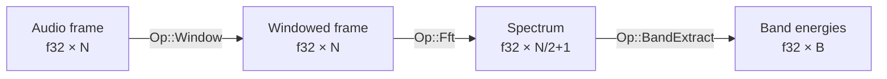
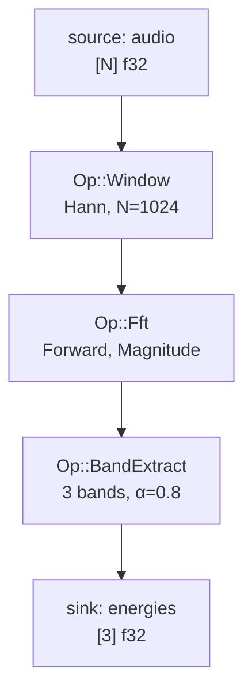

# Signal Processing Ops — Developer Guide

This document describes the three signal-processing operations added in
Phase 3 of the voice-reactive metaballs pipeline:
[`Op::Window`](#window), [`Op::Fft`](#fft), and [`Op::BandExtract`](#bandextract).

It covers the data-flow model, parameter types, the CPU backend implementation,
and how to wire the ops together in a graph.

---

## Overview



The three ops form a linear pipeline:

1. **Window** — multiply each sample by a tapering coefficient to reduce
   spectral leakage.
2. **Fft** — transform the windowed frame into the frequency domain and return
   a one-sided magnitude (or power, or complex) spectrum.
3. **BandExtract** — sum spectrum bins within user-defined frequency bands and
   optionally smooth the result with an exponential moving average (EMA).

---

## Window

### Parameters

```rust
use graph_core::ops::{WindowKind, WindowParams};

let params = WindowParams::new(WindowKind::Hann, 1024).unwrap();
```

| Field | Type | Description |
|-------|------|-------------|
| `kind` | `WindowKind` | `Hann`, `Hamming`, or `Blackman` |
| `size` | `usize` | Number of samples in the frame (must be > 0) |

### Coefficient formulae

For frame index `i` in `0..N`:

| Kind | Formula |
|------|---------|
| Hann | `0.5 × (1 − cos(2π·i / (N−1)))` |
| Hamming | `0.54 − 0.46 × cos(2π·i / (N−1))` |
| Blackman | `0.42 − 0.5 × cos(2π·i / (N−1)) + 0.08 × cos(4π·i / (N−1))` |

### I/O layout

```
inputs[0]  = raw audio frame  [N] f32
outputs[0] = windowed frame   [N] f32
```

---

## Fft

### Parameters

```rust
use graph_core::ops::{FftParams, FftDirection, FftOutput};

let params = FftParams::new(1024, FftDirection::Forward, FftOutput::Magnitude).unwrap();
```

| Field | Type | Description |
|-------|------|-------------|
| `size` | `usize` | FFT size N (must be > 0) |
| `direction` | `FftDirection` | `Forward` or `Inverse` |
| `output` | `FftOutput` | `Magnitude`, `Power`, or `Complex` |

### Output length

| `FftOutput` | Length |
|-------------|--------|
| `Magnitude` | `N/2 + 1` f32 values (one-sided) |
| `Power` | `N/2 + 1` f32 values (one-sided) |
| `Complex` | `N` pairs of f32 (interleaved re/im) |

### Bin-to-frequency mapping

For sample rate `sr` Hz and FFT size `N`, bin `b` corresponds to:

```
f(b) = b × sr / N   Hz
```

### I/O layout

```
inputs[0]  = windowed frame  [N] f32
outputs[0] = spectrum        see table above
```

### Implementation notes

The CPU backend uses [`rustfft`](https://docs.rs/rustfft) with a cached
`FftPlanner` held inside `CpuBackend`. The planner stores twiddle-factor tables
keyed by `(size, direction)`, so repeated FFTs of the same size are cheap.

Real input is zero-padded to complex before the forward transform. The
inverse path is provided for completeness but is not used in the main pipeline.

---

## BandExtract

### Parameters

```rust
use graph_core::ops::{BandDef, BandExtractParams};

let bands = vec![
    BandDef::new(0.0,    250.0,  "sub").unwrap(),
    BandDef::new(250.0,  2000.0, "mid").unwrap(),
    BandDef::new(2000.0, 8000.0, "high").unwrap(),
];
let params = BandExtractParams::new(bands, 44_100.0, 0.8).unwrap();
```

| Field | Type | Description |
|-------|------|-------------|
| `bands` | `Vec<BandDef>` | Frequency band definitions (must be non-empty) |
| `sample_rate_hz` | `f32` | Sample rate in Hz (must be > 0) |
| `smoothing` | `f32` | EMA coefficient α ∈ [0, 1) — `0.0` means stateless |

### Bin mapping

For a one-sided spectrum of length `M = N/2 + 1` at sample rate `sr`:

```
n_full   = 2 × (M − 1)          ← reconstructed full FFT size
bin_low  = floor(low_hz  × n_full / sr)
bin_high = ceil (high_hz × n_full / sr)
energy   = Σ spectrum[bin_low ..= min(bin_high, M−1)]
```

If `bin_low > bin_high` (band too narrow for the FFT resolution), the energy
for that band is `0.0`.

### EMA smoothing

When `smoothing α > 0.0` the op is **stateful**:

```
y[t] = α × x[t] + (1 − α) × y[t−1]
```

The executor prepends the previous state to `inputs` and appends a new-state
slot to `outputs` according to the following convention:

```
Stateful (smoothing > 0):
  inputs[0]  = EMA state  [B] f32   (zeros on first tick)
  inputs[1]  = spectrum   [M] f32
  outputs[0] = energies   [B] f32
  outputs[1] = new state  [B] f32

Stateless (smoothing == 0):
  inputs[0]  = spectrum   [M] f32
  outputs[0] = energies   [B] f32
```

---

## Full pipeline example



### Building the graph

```rust,ignore
use graph_core::graph::GraphBuilder;
use graph_core::ops::{
    BandDef, BandExtractParams, FftDirection, FftOutput, FftParams,
    Op, WindowKind, WindowParams,
};
use graph_core::types::{DType, Dim, Layout, TensorType};

const N: usize = 1024;
const SR: f32 = 44_100.0;

let frame_t   = TensorType::new(DType::F32, vec![Dim::Fixed(N)],       Layout::RowMajor).unwrap();
let spec_t    = TensorType::new(DType::F32, vec![Dim::Fixed(N/2+1)],   Layout::RowMajor).unwrap();
let energy_t  = TensorType::new(DType::F32, vec![Dim::Fixed(3)],       Layout::RowMajor).unwrap();

let graph = GraphBuilder::new()
    .source("audio", frame_t.clone())
    .add_node("window")
        .device("cpu")
        .op(Op::Window(WindowParams::new(WindowKind::Hann, N).unwrap()))
        .input_from_source("audio")
        .output(frame_t.clone())
        .done()
    .add_node("fft")
        .device("cpu")
        .op(Op::Fft(FftParams::new(N, FftDirection::Forward, FftOutput::Magnitude).unwrap()))
        .input_from("window", 0)
        .output(spec_t.clone())
        .done()
    .add_node("band")
        .device("cpu")
        .op(Op::BandExtract(BandExtractParams::new(
            vec![
                BandDef::new(0.0,    250.0,  "sub").unwrap(),
                BandDef::new(250.0,  2000.0, "mid").unwrap(),
                BandDef::new(2000.0, SR/2.0, "high").unwrap(),
            ],
            SR, 0.8,
        ).unwrap()))
        .input_from("fft", 0)
        .output(energy_t.clone())
        .done()
    .sink("energies", energy_t.clone())
        .from("band", 0)
        .done()
    .build()
    .unwrap();
```

### Running with the executor

```rust,ignore
use backends_cpu::CpuBackend;
use runtime::executor::Executor;

let mut exec = Executor::new(graph, vec![Box::new(CpuBackend::new("cpu"))]).unwrap();

// Each tick:
exec.input("audio").unwrap().write("audio", &samples).unwrap();
exec.run().unwrap();
let energies: &[f32] = exec.output("energies").unwrap().read().unwrap();
```

---

## Crate layout

```
backends-cpu/
├── Cargo.toml
└── src/
    ├── lib.rs              CpuBackend struct + Backend impl
    └── signal/
        ├── mod.rs          dispatch router (re-exports sub-modules)
        ├── window.rs       dispatch_window()
        ├── fft.rs          dispatch_fft()
        └── band.rs         dispatch_band_extract()
```

### Dependencies

| Crate | Role |
|-------|------|
| `rustfft = "6"` | FFT planning and execution |
| `num-complex = "0.4"` | `Complex<f32>` type (matches `rustfft` transitive dep) |
| `bytemuck = "1"` | Zero-copy `f32` ↔ `u8` casting |
| `hound = "3"` | WAV encode/decode in integration tests (dev-dep only) |
