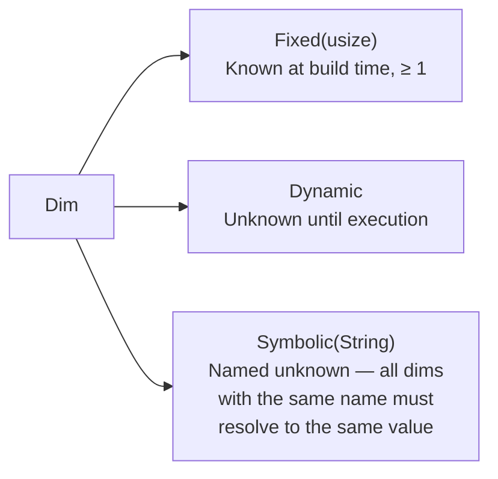

# Tensor Type System

The `tensor_type` module (`src/tensor_type.rs`) provides the core tensor metadata types used to describe tensors flowing along graph edges. It has no GPU SDK dependencies and is 100% safe Rust.

## Overview

A `TensorType` is an immutable, always-valid descriptor combining:

| Field | Type | Description |
|---|---|---|
| `dtype` | `DType` | Scalar element type (e.g. `F32`, `I32`) |
| `shape` | [`Shape`](shape.md) | Validated tensor shape (see [shape.md](shape.md)) |
| `layout` | `Layout` | Memory layout (`RowMajor`, `NCHW`, …) |
| `dim_names` | `Option<Vec<String>>` | Optional per-dimension human-readable names |
| `device` | `Option<DeviceId>` | Optional device placement |

All fields are **private**. Construction goes through validated constructors that enforce invariants at the point of creation, making invalid states unrepresentable.

## Types

### `Dim`

A single tensor dimension.



`Dynamic` and `Symbolic` are separate variants (not `Dynamic(Option<String>)`), making pattern matching unambiguous and preventing the empty-string footgun.

| Method | Description |
|---|---|
| `Dim::fixed(n)` | Returns `Err(ZeroDimension)` if `n == 0` |
| `Dim::symbolic(name)` | Returns `Err(EmptySymbol)` if name is empty |
| `is_fixed()` | `true` for `Fixed(_)` only |
| `is_dynamic()` | `true` for `Dynamic` and `Symbolic` |
| `is_symbolic()` | `true` for `Symbolic` only |
| `fixed_value()` | `Some(n)` for `Fixed(n)`, `None` otherwise |
| `symbol()` | `Some(&str)` for `Symbolic`, `None` otherwise |
| `is_compatible_with(&Dim)` | See compatibility rules below |

**Display:** `Fixed(3)` → `"3"`, `Dynamic` → `"?"`, `Symbolic("batch")` → `"batch"`.

### `Layout`

Memory layout of a contiguous tensor.

| Variant | Description | Required rank |
|---|---|---|
| `RowMajor` | C-contiguous, last dim varies fastest | any |
| `ColMajor` | Fortran-contiguous, first dim varies fastest | any |
| `NCHW` | Batch × Channels × Height × Width (PyTorch) | 4 |
| `NHWC` | Batch × Height × Width × Channels (TensorFlow) | 4 |
| `Any` | No constraint — compatible with every other layout | any |

| Method | Description |
|---|---|
| `is_compatible_with(&Layout)` | `Any` matches everything; otherwise requires equality |
| `is_image_layout()` | `true` for `NCHW` and `NHWC` |
| `expected_rank()` | `Some(4)` for `NCHW`/`NHWC`, `None` otherwise |

### `TensorTypeError`

Every construction or transform error is specific and actionable.

| Variant | When |
|---|---|
| `ZeroDimension` | A `Fixed(0)` dimension was supplied |
| `EmptySymbol` | A `Symbolic("")` dimension was supplied |
| `ScalarWithLayout(layout)` | Rank-0 tensor was given a non-`Any` layout |
| `LayoutRankMismatch { layout, expected, actual }` | `NCHW`/`NHWC` given wrong rank |
| `DimNamesMismatch { names, shape }` | `dim_names` length ≠ shape length |

## Construction

### Short constructors

For the most common shapes, use the zero-ceremony factory functions:

```rust
use graphynx::tensor_type::{Layout, TensorType};
use graphynx::dtype::DType;

// Rank-0: always Layout::Any, infallible.
let s = TensorType::scalar(DType::F32);

// Rank-1: layout defaults to RowMajor.
let v = TensorType::vector(DType::I32, 1024)?;

// Rank-2: layout defaults to RowMajor.
let m = TensorType::matrix(DType::F64, 512, 512)?;

// Arbitrary shape + layout.
let t = TensorType::new(
    DType::F32,
    vec![Dim::Fixed(1), Dim::Fixed(3), Dim::Fixed(224), Dim::Fixed(224)],
    Layout::NCHW,
)?;
```

### Builder

Use the builder when you need `dim_names` or `device`, or when constructing with dynamic/symbolic dimensions:

```rust
use graphynx::tensor_type::{Dim, Layout, TensorType};
use graphynx::backend::DeviceId;
use graphynx::dtype::DType;

let image = TensorType::builder(DType::F32)
    .shape(vec![
        Dim::Symbolic("batch".into()),
        Dim::Fixed(3),
        Dim::Fixed(224),
        Dim::Fixed(224),
    ])
    .layout(Layout::NCHW)
    .dim_names(vec![
        "batch".into(), "channels".into(), "height".into(), "width".into(),
    ])
    .device(DeviceId::new("cuda:0"))
    .build()?;
```

Builder defaults: `shape = []` (scalar), `layout = Any`, `dim_names = None`, `device = None`. Validation runs in `build()`.

## Accessors

All accessors are read-only. There are no setters.

| Method | Return type | Description |
|---|---|---|
| `dtype()` | `DType` | Scalar element type |
| `shape()` | `&Shape` | The validated tensor shape (see [shape.md](shape.md)) |
| `layout()` | `Layout` | Memory layout |
| `dim_names()` | `Option<&[String]>` | Per-dimension names, if set |
| `device()` | `Option<&DeviceId>` | Device placement, if set |
| `rank()` | `usize` | Number of dimensions (delegates to `shape.rank()`) |
| `is_scalar()` | `bool` | `true` when rank == 0 |
| `num_elements()` | `Option<usize>` | Product of all dims; `None` if any dim is dynamic/symbolic. Scalar → `Some(1)`. Delegates to `shape.num_elements()`. |
| `size_bytes()` | `Option<usize>` | `num_elements() * dtype.size_bytes()`; `None` if either is unknown |

## Transforms

Every transform **consumes `self`** and returns a new validated `TensorType`. There are no `&mut self` setters — this prevents partial mutation and leaves-an-invalid-state bugs.

```rust
// Change the layout (re-validates rank constraint).
let t_nchw = t.with_layout(Layout::NCHW)?;

// Place on a device.
let on_gpu = t.with_device(DeviceId::new("cuda:0"));

// Remove device placement.
let unplaced = on_gpu.unplaced();

// Add dimension names.
let named = t.with_dim_names(vec!["batch".into(), "channels".into(), ...])?;
```

Transforms can be chained:

```rust
let t = TensorType::scalar(DType::F32)
    .with_device(DeviceId::new("cpu"))
    .unplaced();
```

## Compatibility

`TensorType::is_compatible_with` answers "can these two tensors be connected by a graph edge?"

```rust
let producer = TensorType::new(DType::F32, vec![Dim::Fixed(3), Dim::Fixed(256)], Layout::RowMajor)?;
let consumer = TensorType::new(DType::F32, vec![Dim::Dynamic, Dim::Fixed(256)], Layout::Any)?;

assert!(producer.is_compatible_with(&consumer)); // true
```

### Compatibility rules

**dtype:** must be identical.

**rank:** must be identical.

**layout:**

| LHS | RHS | Compatible? |
|---|---|---|
| `Any` | anything | yes |
| anything | `Any` | yes |
| `X` | `X` | yes |
| `X` | `Y` (X≠Y) | no |

**per-dimension:**

| LHS | RHS | Compatible? |
|---|---|---|
| `Fixed(a)` | `Fixed(b)` | `a == b` |
| `Fixed(_)` | `Dynamic` | yes |
| `Fixed(_)` | `Symbolic(_)` | yes |
| `Dynamic` | `Dynamic` | yes |
| `Dynamic` | `Symbolic(_)` | yes |
| `Symbolic(a)` | `Symbolic(b)` | `a == b` |

Two `Symbolic` dims with **different names** are incompatible: they may resolve to different runtime values.

**device is not checked** — placement is the scheduler's responsibility.

Compatibility is symmetric: `a.is_compatible_with(&b) == b.is_compatible_with(&a)`.

## Display

`TensorType`, `Dim`, and `Layout` all implement `Display`:

```
f32[] Any                              // scalar, no device
i32[1024] RowMajor                     // vector
f32[batch, 3, 224, 224] NCHW @ cuda:0  // NCHW image on GPU
f64[?, 256] RowMajor                   // dynamic batch dim
f32[batch, ?, 3] Any                   // symbolic + dynamic
```

## Zero-Footgun Summary

| Footgun | Prevention |
|---|---|
| `Fixed(0)` dimension | `Dim::fixed(0)` → `Err`, validated in all constructors |
| `Symbolic("")` name | `Dim::symbolic("")` → `Err`, validated in all constructors |
| Wrong rank for `NCHW`/`NHWC` | Checked in `new`, `with_layout`, and `builder.build()` |
| Scalar with non-`Any` layout | Checked in `new` and `builder.build()` |
| Mismatched `dim_names` length | Checked in `with_dim_names` and `builder.build()` |
| Mutating shared `TensorType` | Fields are private; transforms consume and return new value |
| Partial-update invalid state | No `&mut self` setters; every transform fully re-validates |
| Silent graph-edge type mismatch | `is_compatible_with()` with explicit, documented rules |
| `Dynamic(None)` vs `Dynamic(Some(""))` ambiguity | Separate `Dynamic` and `Symbolic` variants |

## No New Dependencies

`tensor_type` uses only:
- `std::fmt`
- `thiserror` (already in `Cargo.toml`)
- `crate::dtype::DType`
- `crate::backend::DeviceId`
- `crate::shape::Shape`

It has zero GPU SDK dependencies and compiles in any environment.

## Further Reading

- [Shape Module](shape.md) — `Shape`, broadcasting, reshape validation, and stride computation
- [DType](dtype.md) — scalar element type enum
- [Backend Trait System](backend-trait.md) — `DeviceId` used for device placement
- [ML Op Catalog](ml-op.md) — `MlOp` operations that consume `TensorType` tensors
- [Architecture Overview](architecture.md) — where `TensorType` sits in the layered design
