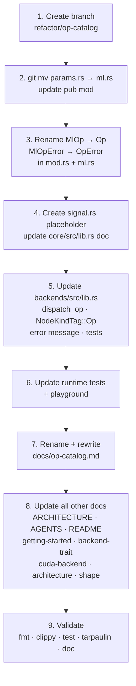

# Voice-Reactive Metaballs — Implementation Plan

> **Status:** Planning  
> **Last updated:** 2026-05-05  
> **Tracking:** Update the status line of each phase as work progresses.
>
> | Phase | Status |
> |-------|--------|
> | 0 — Op Catalog Refactor | ✅ Complete |
> | 1 — Graph IR | ✅ Complete |
> | 2 — Synchronous Executor | ✅ Complete |
> | 3 — Signal Processing Ops + CPU Backend | ✅ Complete |
> | 4 — nodemoss Integration (Synthetic Audio) | ✅ Complete |
> | 5 — Live Audio Capture | 🔲 Not started |

---

## Overview

Build a real-time audio spectral analysis pipeline through graphynx (used as a
library) that drives metaball animations in nodemoss. This serves as the first
concrete end-to-end example of graphynx as a dataflow execution engine, forcing
implementation of the graph IR, executor, a new op domain (signal processing),
and cross-project integration.

**Strategy:** Each phase produces a working, tested, committed state. No phase
depends on "the next phase will fix this." Each phase can be validated
independently before the next begins.

### Key architectural decisions

These decisions were made during design and must not be revisited without
updating this document:

| Decision | Choice | Rationale |
|----------|--------|-----------|
| Op catalog name | `Op` (renamed from `MlOp`) | Short, universal; covers ML, signal, image, and future domains |
| Op catalog organisation | Single flat `Op` enum, domain params in sub-modules (`ops/ml.rs`, `ops/signal.rs`) | Avoids per-domain `NodeKind` variants; backends dispatch on one enum |
| Backend dispatch | `dispatch_op(&self, op: &Op, ...)` — full structured op reference | Type-safe; no string lookup; `backends` already depends on `graph-core` |
| Graph boundary | `SourcePort` / `SinkPort` — typed boundary ports, not `NodeKind` variants | Nodes compute; sources/sinks are I/O boundaries — different concepts |
| Graph as typed function | `(Source₁, Source₂, ...) → (Sink₁, Sink₂, ...)` declared at build time | Enables validation of input types before execution |
| Stateful nodes | `ExecutionState` owned by executor (`HashMap<NodeId, Box<dyn Any + Send>>`) | Graph stays immutable; state is an execution concern, not a graph concern |
| Execution mode | Synchronous first; threading-agnostic interface designed from day one | Avoids premature lock-free complexity; upgrade path is documented |
| Frequency bands | 3 bands: Low 80–300 Hz, Mid 300–2000 Hz, High 2000–6000 Hz | Maps directly to 4 metaballs; expandable to 6 bands later |
| Integration | graphynx as a library inside nodemoss — no IPC, no separate process | Simplest path; both are Rust; direct function calls |
| First audio source | WAV file (Phase 4), then live mic via cpal (Phase 5) | Deterministic testing before real-time complexity |

### Dependency graph after all phases

```
graph-core
    ↑
backends          (depends on graph-core)
    ↑           ↑
backends-cpu    backends-cuda   (depend on backends)
    ↑
runtime           (depends on graph-core + backends + backends-cpu;
                   backends-cuda is optional behind the "cuda" feature)
    ↑
[nodemoss/examples/voice_metaballs]  (depends on runtime + rig-app)
```

---

## Phase 0 — Op Catalog Refactor

**Status:** ✅ Complete  
**Branch:** `refactor/op-catalog`  
**Goal:** Broaden the operation catalog from ML-specific to a general compute
catalog. Change the backend dispatch interface to pass structured op descriptors.
Pure refactoring — no new functionality.

### Rationale

The original `MlOp` name implied the catalog was ML-only. Signal processing
operations (Phase 3: `Fft`, `Window`, `BandExtract`) have nothing to do with
ML but need to live in the same catalog. Renaming to `Op` makes the catalog
domain-agnostic. Simultaneously, `dispatch_ml_op(&str, ...)` was upgraded to
`dispatch_op(&Op, ...)` — a typed reference — so backends have access to full
operation parameters at dispatch time (fixing a design gap identified in the
architecture review).

### Naming

| Before | After |
|--------|-------|
| `MlOp` | `Op` |
| `MlOpError` | `OpError` |
| `NodeKindTag::MlOp` | `NodeKindTag::Op` |
| `dispatch_ml_op(&str, ...)` | `dispatch_op(&Op, ...)` |
| `"Unsupported ML op"` | `"Unsupported op"` |
| `core/src/ops/params.rs` | `core/src/ops/ml.rs` |
| `docs/ml-op.md` | `docs/op-catalog.md` |

### Execution steps



### Steps

1. **Create branch** — `git checkout -b refactor/op-catalog`

2. **Rename `params.rs` → `ml.rs`**
   - `git mv core/src/ops/params.rs core/src/ops/ml.rs`
   - `core/src/ops/mod.rs`: `pub mod params;` → `pub mod ml; pub mod signal;`
   - Update `pub use` block: `params::` → `ml::`
   - `core/src/ops/ml.rs`: `use super::MlOpError;` → `use super::OpError;`
   - Validate: `cargo test -p graph-core`

3. **Rename enum and error type** in `core/src/ops/mod.rs`
   - `pub enum MlOpError` → `pub enum OpError`
   - `pub enum MlOp` → `pub enum Op`
   - All `impl MlOp` → `impl Op`, all `impl fmt::Display for MlOp` → `impl fmt::Display for Op`
   - All `MlOpError::Variant` → `OpError::Variant` in `ml.rs`
   - All doc comments, doc-tests, test functions
   - Validate: `cargo test -p graph-core` and `cargo test --doc -p graph-core`

4. **Create `signal.rs` placeholder** and update `core/src/lib.rs` doc comment

5. **Update `backends/src/lib.rs`**
   - Add `use graph_core::ops::Op;`
   - `NodeKindTag::MlOp` → `NodeKindTag::Op`
   - `dispatch_ml_op(&str, ...)` → `dispatch_op(&Op, ...)`
   - `warn!("dispatch_ml_op ...")` → `warn!("dispatch_op ...")`
   - `BackendError::UnsupportedOp` display: `"Unsupported ML op"` → `"Unsupported op"`
   - Update all tests: tag names, debug format strings, test function names
   - Validate: `cargo test -p backends`

6. **Update downstream consumers**
   - `runtime/tests/type_system_toy.rs`: `MlOp` → `Op`
   - `playground/src/scratch.rs`: `MlOp` → `Op`, `ops::params::` → `ops::ml::`
   - `backends-cuda/src/lib.rs`: comment update only (no dispatch override)
   - Validate: `cargo test` (full workspace)

7. **Rename and rewrite `docs/ml-op.md` → `docs/op-catalog.md`**
   - `git mv docs/ml-op.md docs/op-catalog.md`
   - Add migration note at top
   - Update all `MlOp` → `Op`, `MlOpError` → `OpError`
   - Add domain organisation mermaid diagram
   - Add Signal domain section (Phase 3 placeholder)
   - Add module organisation mermaid diagram

8. **Update all other documentation**
   - `ARCHITECTURE.md` — ~30 occurrences
   - `AGENTS.md` — 2 occurrences
   - `README.md` — 1 occurrence
   - `docs/getting-started.md`, `docs/backend-trait.md`, `docs/cuda-backend.md`,
     `docs/architecture.md`, `docs/tensor-type.md`, `docs/shape.md`
   - `core/Cargo.toml` description

9. **Validate**
   ```bash
   nix develop --command cargo fmt --check
   nix develop --command cargo clippy
   nix develop --command cargo test
   nix develop --command cargo tarpaulin   # coverage must not regress
   nix develop --command cargo doc --no-deps
   ```

### Files touched

| File | Change |
|------|--------|
| `core/src/ops/mod.rs` | Rename enum + error, update all methods, tests, doc-tests |
| `core/src/ops/params.rs` → `core/src/ops/ml.rs` | Git rename + update imports |
| `core/src/ops/signal.rs` | New empty placeholder |
| `core/src/lib.rs` | Update module doc comment |
| `core/Cargo.toml` | Update description field |
| `backends/src/lib.rs` | Rename dispatch method + typed signature, `NodeKindTag`, error message, tests |
| `backends-cuda/src/lib.rs` | Comment update only |
| `runtime/tests/type_system_toy.rs` | Update `Op` imports and usage |
| `playground/src/scratch.rs` | Update imports and usage |
| `docs/ml-op.md` → `docs/op-catalog.md` | Git rename + full rewrite |
| `ARCHITECTURE.md` | Replace `MlOp` throughout (~30 occurrences) |
| `AGENTS.md` | Update 2 lines |
| `README.md` | Update 1 line |
| `docs/getting-started.md` | Update ~6 occurrences |
| `docs/backend-trait.md` | Update 3 occurrences |
| `docs/cuda-backend.md` | Update 2 occurrences |
| `docs/architecture.md` | Update 6 occurrences |
| `docs/tensor-type.md` | Update 1 cross-reference |
| `docs/shape.md` | Update 1 cross-reference |

### Risk

High churn — 261 occurrences of `MlOp`/`MlOpError` across `.rs` and `.md`
files. All changes are mechanical but error-prone. Mitigations:

- Execute as concentric ripple: definition site → consumers → docs
- Run `cargo test` after each compilable sub-step
- Use `grep -r MlOp` as a final check before committing

---

## Phase 1 — Graph IR

**Status:** ✅ Complete  
**Branch:** `feat/graph-ir`  
**Goal:** Implement the core graph data structure with typed source/sink ports,
nodes, edges, a builder API, and DAG validation. No execution — this is purely
the data model.

### New module structure

```
core/src/graph/
  mod.rs        — Graph, SourcePort, SinkPort, SinkConnection, GraphError
  node.rs       — Node, NodeId, NodeKind
  edge.rs       — Edge, PortRef, EdgeSource
  builder.rs    — GraphBuilder (fluent API)
  validate.rs   — DAG check, type compatibility, port coverage
```

### Data model

```rust
// core/src/graph/node.rs

#[derive(Copy, Clone, Eq, PartialEq, Hash, Debug)]
pub struct NodeId(pub(crate) usize);

pub enum NodeKind {
    /// Raw compute kernel (CUDA PTX, SPIR-V, native Rust fn, …).
    Compute(Box<dyn KernelDescriptor>),
    /// Catalogued primitive operation.
    Op(Op),
    // MlModel deferred — not needed for this use case
}

pub struct Node {
    pub id:       NodeId,
    pub name:     String,
    pub device:   DeviceId,
    pub kind:     NodeKind,
    pub inputs:   Vec<TensorType>,   // declared input port types
    pub outputs:  Vec<TensorType>,   // declared output port types
    /// Whether this node requires state across executor ticks.
    /// If true, the executor allocates a state slot in ExecutionState.
    pub stateful: bool,
}

// core/src/graph/edge.rs

pub struct PortRef {
    pub node: NodeId,
    pub port: usize,
}

pub enum EdgeSource {
    /// Data comes from a graph source port (by index into Graph::sources).
    Source(usize),
    /// Data comes from a node's output port.
    Node(PortRef),
}

pub struct Edge {
    pub from: EdgeSource,
    pub to:   PortRef,     // always a node input port
}

// core/src/graph/mod.rs

pub struct SourcePort {
    pub name:        String,
    pub tensor_type: TensorType,
}

pub struct SinkPort {
    pub name:        String,
    pub tensor_type: TensorType,
}

pub struct SinkConnection {
    pub from: PortRef,   // node output port
    pub sink: usize,     // index into Graph::sinks
}

pub struct Graph {
    pub sources:          Vec<SourcePort>,
    pub sinks:            Vec<SinkPort>,
    pub(crate) nodes:     Vec<Node>,
    pub(crate) edges:     Vec<Edge>,
    pub(crate) sink_cons: Vec<SinkConnection>,
}
```

### Builder API

```rust
let graph = GraphBuilder::new()
    .source("audio_frame", tensor_type_f32([2048]))
    .source("params",      tensor_type_f32([3]))
    .add_node("window")
        .device("cpu")
        .op(Op::Window(WindowParams { kind: WindowKind::Hann, size: 2048 }))
        .input_from_source("audio_frame")
        .output(tensor_type_f32([2048]))
        .done()
    .add_node("fft")
        .device("cpu")
        .op(Op::Fft(FftParams { size: 2048, direction: FftDirection::Forward,
                                output: FftOutput::Magnitude }))
        .input_from("window", 0)
        .output(tensor_type_f32([1025]))
        .done()
    .add_node("bands")
        .device("cpu")
        .op(Op::BandExtract(BandExtractParams { ... }))
        .input_from("fft", 0)
        .output(tensor_type_f32([3]))
        .stateful()          // declares EMA state needed
        .done()
    .sink("band_energies", tensor_type_f32([3]))
        .from("bands", 0)
    .build()?;
```

### Validation passes (in `validate.rs`)

1. **DAG check** — Kahn's algorithm; error on cycle
2. **Type compatibility** — each edge's source `TensorType` must be compatible
   with the destination's declared input type (`Static` dims must match exactly;
   `Dynamic` dims are compatible with anything)
3. **Port coverage** — every node input port is connected exactly once
4. **Source coverage** — every declared source connects to at least one node
5. **Sink coverage** — every sink has exactly one `SinkConnection`
6. **Device declared** — every node has a non-empty device ID string

### Steps

1. Create `core/src/graph/` directory and module files
2. Implement `NodeId`, `Node`, `NodeKind` in `node.rs`
3. Implement `Edge`, `PortRef`, `EdgeSource` in `edge.rs`
4. Implement `Graph`, `SourcePort`, `SinkPort`, `SinkConnection` in `mod.rs`
5. Implement `GraphBuilder` with fluent API in `builder.rs`
6. Implement validation passes in `validate.rs`
7. Add `pub mod graph;` to `core/src/lib.rs`
8. Write unit tests:
   - Valid 2-node graph builds successfully
   - Cycle detection returns `GraphError::Cycle`
   - Type mismatch on an edge returns `GraphError::TypeMismatch`
   - Unconnected input port returns `GraphError::UnconnectedPort`
   - Missing sink connection returns `GraphError::UnconnectedSink`
9. Write doc-tests for the builder API
10. Validate: `cargo test`, `cargo clippy`, `cargo tarpaulin`

### Files touched

| File | Change |
|------|--------|
| `core/src/lib.rs` | Add `pub mod graph;` |
| `core/src/graph/mod.rs` | New |
| `core/src/graph/node.rs` | New |
| `core/src/graph/edge.rs` | New |
| `core/src/graph/builder.rs` | New |
| `core/src/graph/validate.rs` | New |

### Dependency impact

None — graph IR uses only existing core types (`TensorType`, `DeviceId`, `Op`).

---

## Phase 2 — Synchronous Executor

**Status:** ✅ Complete  
**Branch:** `feat/executor`  
**Goal:** Implement a one-shot synchronous executor that runs a graph from
sources to sinks, dispatching nodes in topological order. Includes
`ExecutionState` for stateful nodes and typed `InputHandle`/`OutputHandle` for
feeding and reading data.

### Location

Extends the existing `runtime` crate (already depends on `backends` +
`graph-core`). The current `run_kernel` convenience function is retained
unchanged.

### New module structure

```
runtime/src/executor/
  mod.rs        — Executor struct, public API
  scheduler.rs  — topological sort (Kahn's algorithm)
  state.rs      — ExecutionState
  handle.rs     — InputHandle, OutputHandle (synchronous, threading-agnostic)
  buffer.rs     — host-side buffer management for inter-node edges
  error.rs      — ExecutorError enum
```

### Core types

```rust
// runtime/src/executor/error.rs
#[derive(Debug, Error)]
pub enum ExecutorError {
    #[error("No backend registered for device '{0}'")]
    NoBackend(String),
    #[error("Input '{0}' not found in graph sources")]
    UnknownInput(String),
    #[error("Input '{0}' has wrong byte length: expected {expected}, got {got}")]
    InputSizeMismatch { name: String, expected: usize, got: usize },
    #[error("Backend error on node '{node}': {source}")]
    Backend { node: String, source: BackendError },
    #[error("Graph validation failed: {0}")]
    InvalidGraph(String),
}

// runtime/src/executor/state.rs
pub struct ExecutionState {
    slots: HashMap<NodeId, Box<dyn Any + Send>>,
}

impl ExecutionState {
    pub fn new() -> Self;
    pub fn get<T: 'static>(&self, node: NodeId) -> Option<&T>;
    pub fn get_mut<T: 'static>(&mut self, node: NodeId) -> Option<&mut T>;
    pub fn insert<T: Send + 'static>(&mut self, node: NodeId, state: T);
    pub fn contains(&self, node: NodeId) -> bool;
}

// runtime/src/executor/handle.rs

/// Feed data into a named graph source before calling Executor::run().
/// Threading-agnostic: the synchronous implementation stores data inline;
/// a future threaded implementation will write to a ring buffer instead.
pub struct InputHandle {
    data: Option<Vec<u8>>,
    tensor_type: TensorType,
}

impl InputHandle {
    pub fn write<T: bytemuck::Pod>(&mut self, data: &[T]);
    pub fn write_bytes(&mut self, data: &[u8]);
}

/// Read data from a named graph sink after calling Executor::run().
pub struct OutputHandle {
    data: Option<Vec<u8>>,
    tensor_type: TensorType,
}

impl OutputHandle {
    pub fn read<T: bytemuck::Pod>(&self) -> Option<&[T]>;
    pub fn read_bytes(&self) -> Option<&[u8]>;
}

// runtime/src/executor/mod.rs
pub struct Executor {
    graph:    Graph,
    schedule: Vec<NodeId>,                       // pre-computed topo order
    state:    ExecutionState,
    backends: HashMap<DeviceId, Box<dyn Backend>>,
}

impl Executor {
    /// Build an executor from a validated graph and a set of backends.
    /// Validates that every node's device has a registered backend.
    pub fn new(
        graph:    Graph,
        backends: Vec<Box<dyn Backend>>,
    ) -> Result<Self, ExecutorError>;

    /// Run one tick of the graph synchronously.
    ///
    /// `inputs` maps source names to raw byte slices.
    /// Returns a map of sink names to output byte vectors.
    pub fn run(
        &mut self,
        inputs: &[(&str, &[u8])],
    ) -> Result<HashMap<String, Vec<u8>>, ExecutorError>;
}
```

### Execution loop

```
Executor::run(inputs):
  1. Validate: every declared source name appears in inputs with correct byte length
  2. Build edge buffer map: source_name → &[u8] from caller-supplied inputs
  3. For each NodeId in pre-computed topological order:
     a. Gather input byte slices from edge buffer map (source ports or upstream outputs)
     b. Look up backend by node.device
     c. Allocate output byte buffers (sized from node.outputs TensorType)
     d. If node.stateful:
          - Retrieve state bytes from ExecutionState (or zeros if first tick)
          - Prepend to inputs; append an output slot for updated state
     e. Match node.kind:
          NodeKind::Op(op)       → backend.dispatch_op(op, &inputs, &mut outputs)
          NodeKind::Compute(desc)→ backend.dispatch_compute(desc, ...)
     f. If node.stateful: pop last output slot → store back in ExecutionState
     g. Store node output buffers in edge buffer map keyed by (NodeId, port)
  4. Collect sink values: for each SinkConnection, copy from edge buffer map
  5. Return HashMap<sink_name, Vec<u8>>
```

### Stateful node convention

For nodes marked `stateful: true`, the executor threads state as follows:

- **Inputs to backend:** `[state_bytes, input_0, input_1, ...]`
- **Outputs from backend:** `[output_0, output_1, ..., updated_state_bytes]`

The state shape is declared by the `Op` variant. Each stateful `Op` variant
must implement a `state_shape(&self) -> TensorType` method (added in Phase 3
for `BandExtract`). The executor uses this to size the state buffer on first
tick.

### Steps

1. Create `runtime/src/executor/` module directory
2. Implement `ExecutorError` in `error.rs`
3. Implement topological sort (Kahn's algorithm) in `scheduler.rs`
4. Implement `ExecutionState` in `state.rs`
5. Implement `InputHandle` / `OutputHandle` in `handle.rs`
6. Implement edge buffer management in `buffer.rs`
7. Implement `Executor::new()` and `Executor::run()` in `mod.rs`
8. Add `pub mod executor;` to `runtime/src/lib.rs`
9. Write unit tests using a mock CPU backend:
   - 2-node passthrough: source → identity-op node → sink
   - 3-node chain: source → A → B → sink
   - Missing backend returns `ExecutorError::NoBackend`
   - Unknown input name returns `ExecutorError::UnknownInput`
   - Stateful node accumulates state across multiple `run()` calls
10. Validate: `cargo test`, `cargo clippy`, `cargo tarpaulin`

### Files touched

| File | Change |
|------|--------|
| `runtime/src/lib.rs` | Add `pub mod executor;` |
| `runtime/src/executor/mod.rs` | New |
| `runtime/src/executor/scheduler.rs` | New |
| `runtime/src/executor/state.rs` | New |
| `runtime/src/executor/handle.rs` | New |
| `runtime/src/executor/buffer.rs` | New |
| `runtime/src/executor/error.rs` | New |

### New runtime dependencies

None — `runtime` already depends on `graph-core`, `backends`, and `bytemuck`.

---

## Phase 3 — Signal Processing Ops + CPU Backend

**Status:** ✅ Complete  
**Branch:** `feat/signal-ops`  
**Goal:** Add `Op::Fft`, `Op::Window`, and `Op::BandExtract` to the catalog.
Implement a new `backends-cpu` crate that dispatches these ops using `rustfft`.
Test with synthetic sine waves and a WAV file fixture.

### New op variants

```rust
// core/src/ops/signal.rs

/// Parameters for a Fast Fourier Transform.
#[derive(Clone, Debug, PartialEq)]
pub struct FftParams {
    /// Number of samples. Must be > 0. Power-of-two recommended for performance.
    pub size: usize,
    pub direction: FftDirection,
    /// What the output tensor contains.
    pub output: FftOutput,
}

#[derive(Clone, Debug, PartialEq)]
pub enum FftDirection { Forward, Inverse }

#[derive(Clone, Debug, PartialEq)]
pub enum FftOutput {
    /// Complex values: output shape is [size], dtype Complex32 (2×f32 interleaved).
    Complex,
    /// Magnitude spectrum: output shape is [size/2 + 1], dtype F32.
    Magnitude,
    /// Power spectrum (magnitude²): output shape is [size/2 + 1], dtype F32.
    Power,
}

/// Parameters for a windowing function applied to a frame before FFT.
#[derive(Clone, Debug, PartialEq)]
pub struct WindowParams {
    pub kind: WindowKind,
    /// Must match the input frame length.
    pub size: usize,
}

#[derive(Clone, Debug, PartialEq)]
pub enum WindowKind { Hann, Hamming, Blackman }

/// Parameters for frequency band energy extraction.
///
/// Input: magnitude or power spectrum `[size/2 + 1]` F32.
/// Output: band energies `[bands.len()]` F32.
#[derive(Clone, Debug, PartialEq)]
pub struct BandExtractParams {
    pub bands:         Vec<BandDef>,
    pub sample_rate_hz: f32,
    /// Exponential moving average smoothing factor in `[0.0, 1.0)`.
    /// `0.0` = no smoothing (stateless); `> 0.0` = stateful EMA.
    pub smoothing:     f32,
}

#[derive(Clone, Debug, PartialEq)]
pub struct BandDef {
    pub low_hz:  f32,
    pub high_hz: f32,
    /// Human-readable label for visualisation ("low", "mid", "high").
    pub label:   String,
}
```

The `Op` enum gains three new variants in `core/src/ops/mod.rs`:

```rust
// ── Signal processing ────────────────────────────────────────────────
/// Fast Fourier Transform.
Fft(FftParams),
/// Windowing function applied to a frame before FFT.
Window(WindowParams),
/// Frequency band energy extraction from a magnitude or power spectrum.
BandExtract(BandExtractParams),
```

`BandExtract` with `smoothing > 0.0` is stateful. Its `state_shape()` returns
`TensorType { dtype: DType::F32, shape: [bands.len()], ... }` — one f32 per
band (the EMA accumulator).

### New crate: `backends-cpu`

```
backends-cpu/
  Cargo.toml
  src/
    lib.rs              — CpuBackend struct + Backend impl
    signal/
      mod.rs            — dispatch_op match for signal ops
      fft.rs            — rustfft wrapper (FftPlanner cached in CpuBackend)
      window.rs         — Hann, Hamming, Blackman implementations
      band.rs           — bin-range extraction + EMA application
  tests/
    fft_sine.rs         — FFT of 440 Hz sine → peak at expected bin
    band_extract.rs     — 440 Hz energy lands in mid band
    wav_pipeline.rs     — end-to-end graph run on WAV fixture
    fixtures/
      test_voice.wav    — short WAV with known frequency content
```

`backends-cpu/Cargo.toml`:
```toml
[dependencies]
graph-core = { workspace = true }
backends   = { workspace = true }
bytemuck   = { workspace = true }
log        = { workspace = true }
rustfft    = { workspace = true }

[dev-dependencies]
hound = { workspace = true }
```

Workspace `Cargo.toml` additions:
```toml
[workspace]
members = [..., "backends-cpu"]

[workspace.dependencies]
rustfft = "6"
hound   = { version = "3", optional = true }  # dev only
```

### FftPlanner caching

`rustfft::FftPlanner` is held inside `CpuBackend` — it caches twiddle factors
across calls. This is backend-level state (like `CudaBackend` holding a
`CudaDevice`), not graph state.

```rust
pub struct CpuBackend {
    device_id:   DeviceId,
    fft_planner: Mutex<FftPlanner<f32>>,
}
```

### Test fixtures

| Test | Input | Expected output |
|------|-------|-----------------|
| FFT of 440 Hz sine | 2048 samples @ 44100 Hz, pure 440 Hz tone | Peak at bin `round(440 * 2048 / 44100)` = bin 20 |
| Window function | Constant-1 frame | Hann window output matches known coefficients |
| BandExtract (440 Hz) | Magnitude spectrum from above FFT | All energy in mid band (300–2000 Hz); low and high bands near zero |
| BandExtract EMA | Two consecutive frames, smoothing=0.5 | Second output is weighted average of frames |
| WAV pipeline | `test_voice.wav` through full graph | Produces `[3]` f32 band energies without panic |

### Steps

1. Add `rustfft = "6"` and `hound = "3"` (dev) to workspace `Cargo.toml`
2. Create `core/src/ops/signal.rs` with param structs and validated constructors
3. Add `Op::Fft`, `Op::Window`, `Op::BandExtract` to `core/src/ops/mod.rs`
4. Update `Op::name()`, `Op::is_parameterless()`, `Op::is_stateful()` (new
   helper) match arms
5. Add `state_shape()` method to `Op` (returns `Option<TensorType>`)
6. Create `backends-cpu/` crate
7. Implement `CpuBackend` with `Backend` trait
8. Implement `dispatch_op` for `Op::Window` → apply window coefficients
9. Implement `dispatch_op` for `Op::Fft` → `rustfft` forward/inverse
10. Implement `dispatch_op` for `Op::BandExtract` → sum bins per band, apply EMA
11. Add `backends-cpu` to workspace members
12. Write all tests listed above
13. Include `test_voice.wav` fixture (generate with any audio tool, or use a
    freely licensed sample; must be mono, 44100 Hz, 16-bit PCM)
14. Validate: `cargo test`, `cargo clippy`, `cargo tarpaulin`

### Files touched

| File | Change |
|------|--------|
| `Cargo.toml` | Add `backends-cpu` member, `rustfft`, `hound` deps |
| `core/src/ops/mod.rs` | Add 3 variants, update methods |
| `core/src/ops/signal.rs` | New (was empty placeholder) |
| `backends-cpu/` | New crate (all files) |

---

## Phase 4 — nodemoss Integration (Synthetic Audio)

**Status:** ✅ Complete  
**Branch (in nodemoss):** `feat/voice-metaballs` (merged to `main`)  
**Goal:** Add `examples/voice_metaballs` to nodemoss. Depend on graphynx as a
path library. Build the audio analysis graph at startup. Drive metaball
animation from band energies. Use deterministic additive synthesis instead of a
WAV file — no binary assets, no `hound` dependency, reproducible across runs.

> **Implementation note:** The original plan called for a WAV file source. During
> implementation, synthetic audio generation was chosen instead: it avoids
> committing binary fixtures, removes the `hound` dependency, and keeps the
> example fully self-contained. The graphynx pipeline is identical; only the
> audio source differs.

### Cross-project dependency

```toml
# nodemoss/examples/voice_metaballs/Cargo.toml
[dependencies]
rig-app    = { path = "../../crates/app" }
rig-assets = { path = "../../crates/assets" }
rig-math   = { path = "../../crates/math" }
anyhow     = "1"
log        = "0.4"
env_logger = "0.11"
bytemuck   = { version = "1", features = ["derive"] }

# Graphynx — path dependency for co-located development
graph-core   = { path = "../../../rustycuda/core" }
backends     = { path = "../../../rustycuda/backends" }
backends-cpu = { path = "../../../rustycuda/backends-cpu" }
runtime      = { path = "../../../rustycuda/runtime" }
```

Note: `runtime` is depended on without the `cuda` feature, so `backends-cuda`
is not pulled in and no CUDA toolchain is required.

### Application state

```rust
struct VoiceMetaballsApp {
    // Scene
    camera_node:    NodeId,
    camera_rig:     CameraRig,
    metaball_node:  NodeId,
    dyn_id:         DynamicMeshId,
    pending_mesh:   Option<DynamicMeshData>,
    elapsed:        f64,
    triangle_count: u32,

    // Audio / signal pipeline
    preset:          VoicePreset,
    executor:        Executor,
    /// Smoothed band energies [low, mid, high] — render-side EMA.
    smooth_energies: [f32; 3],
    /// Accumulated audio phase (seconds) — keeps synthesis continuous.
    audio_phase:     f32,

    // HUD
    debug_hud:     DebugHud,
    hud_preset:    rig_app::rig_overlay::ElementId,
    hud_energies:  rig_app::rig_overlay::ElementId,
    hud_triangles: rig_app::rig_overlay::ElementId,
}
```

### Synthetic audio generation

Each frame, `synthesise_frame(preset, phase_offset)` produces `FFT_SIZE` (1024)
samples of additive synthesis:

- Harmonics of the fundamental (`f0`) with 1/n amplitude roll-off (sawtooth-like source).
- Three formant resonances (Gaussian-shaped amplitude envelope in frequency).
- A small white-noise floor for breathiness, generated with a deterministic LCG
  (no `rand` dependency; reproducible across runs).
- Normalised to `[-1, 1]` after mixing.

### Voice presets

```rust
enum VoicePreset { Male, Female, Neutral }

impl VoicePreset {
    /// Fundamental frequency in Hz.
    fn fundamental_hz(self) -> f32 {
        match self {
            VoicePreset::Male    => 120.0,
            VoicePreset::Female  => 220.0,
            VoicePreset::Neutral => 170.0,
        }
    }

    /// Formant centre frequencies in Hz (F1, F2, F3).
    fn formants_hz(self) -> [f32; 3] {
        match self {
            VoicePreset::Male    => [700.0, 1_200.0, 2_500.0],
            VoicePreset::Female  => [900.0, 1_800.0, 2_800.0],
            VoicePreset::Neutral => [800.0, 1_500.0, 2_650.0],
        }
    }
}
```

### Graph built at startup (per preset)

```rust
fn build_pipeline(preset: VoicePreset) -> Result<Executor> {
    let spectrum_len = FFT_SIZE / 2 + 1;   // FFT_SIZE = 1024

    let graph = GraphBuilder::new()
        .source("audio", TensorType::f32_1d(FFT_SIZE))
        .add_node("window")
            .device("cpu:0")
            .op(Op::Window(WindowParams::new(WindowKind::Hann, FFT_SIZE)?))
            .input_from_source("audio")
            .output(TensorType::f32_1d(FFT_SIZE))
            .done()
        .add_node("fft")
            .device("cpu:0")
            .op(Op::Fft(FftParams::new(FFT_SIZE, FftDirection::Forward,
                                       FftOutput::Magnitude)?))
            .input_from("window", 0)
            .output(TensorType::f32_1d(spectrum_len))
            .done()
        .add_node("bands")
            .device("cpu:0")
            .op(Op::BandExtract(BandExtractParams::new(bands, SAMPLE_RATE, 0.6)?))
            .stateful()
            .input_from("fft", 0)
            .output(TensorType::f32_1d(3))
            .done()
        .sink("energies", TensorType::f32_1d(3))
            .from("bands", 0)
            .done()
        .build()?;

    let backend: Box<dyn Backend> = Box::new(CpuBackend::new("cpu:0"));
    Executor::new(graph, vec![backend])
}
```

### Frequency bands

| Band | Range | Drives |
|------|-------|--------|
| Low  | 20–250 Hz | Orbit radii of balls 0 and 1 |
| Mid  | 250–4 000 Hz | Orbit radii of balls 2 and 3 |
| High | 4 000–20 000 Hz | ISO threshold (surface tension) |

### Animation mapping

```rust
// Constants
const RESPONSIVENESS: f32 = 8.0;  // render-rate EMA speed
const ISO_BASE:        f32 = 1.0;
const ISO_RANGE:       f32 = 0.6;

// In update():
let alpha = 1.0 - (-dt * RESPONSIVENESS).exp();
for (i, &e) in raw_energies.iter().enumerate().take(3) {
    smooth_energies[i] += alpha * (e - smooth_energies[i]);
}

let norm = |e: f32| (e / (e + 1.0)).min(1.0);
let low  = norm(smooth_energies[0]);
let mid  = norm(smooth_energies[1]);
let high = norm(smooth_energies[2]);

let r_low = 2.5 + low * 1.5;   // balls 0 & 1
let r_mid = 2.5 + mid * 1.5;   // balls 2 & 3
let iso   = ISO_BASE + high * ISO_RANGE;
```

### Keyboard controls

| Key | Action |
|-----|--------|
| `1` | Switch to Male voice preset (rebuilds graph) |
| `2` | Switch to Female voice preset (rebuilds graph) |
| `3` | Switch to Neutral voice preset (rebuilds graph) |
| `F3` | Toggle overlay |
| `F4` | Toggle wireframe |
| `Escape` | Quit |

### Steps completed

1. Created `nodemoss/examples/voice_metaballs/Cargo.toml` with graphynx path deps
2. Added `voice_metaballs` to nodemoss workspace `Cargo.toml`
3. Made `backends-cuda` optional in `runtime/Cargo.toml` (behind `cuda` feature)
   so `voice_metaballs` can depend on `runtime` without a CUDA toolchain
4. Implemented `VoicePreset` enum with `fundamental_hz()` and `formants_hz()`
5. Implemented `synthesise_frame()` — deterministic additive synthesis
6. Implemented `build_pipeline()` using the fluent `GraphBuilder` API
7. Implemented `Application` trait: `init`, `update`, `render`, `update_overlay`,
   `on_window_event`
8. Added keyboard handling for preset switching (rebuilds graph + resets EMA state)
9. Added band energy and triangle count display to debug HUD
10. Wrote 15 unit tests (presets, synthesis, pipeline, metaball field)
11. Validated: `cargo test`, `cargo clippy -- -D warnings`, `cargo fmt --check`
12. Merged `feat/voice-metaballs` → `main` in nodemoss

### Files touched (in nodemoss)

| File | Change |
|------|--------|
| `Cargo.toml` | Added `voice_metaballs` workspace member |
| `examples/voice_metaballs/Cargo.toml` | New |
| `examples/voice_metaballs/src/main.rs` | New (853 lines, 15 unit tests) |

### Files touched (in graphynx)

| File | Change |
|------|--------|
| `runtime/Cargo.toml` | `backends-cuda` made optional behind `cuda` feature; `demo` binary requires `--features cuda` |

---

## Phase 5 — Live Audio Capture

**Status:** 🔲 Not started  
**Branch (in graphynx):** `feat/audio-source`  
**Goal:** Replace WAV file input with real-time microphone capture via `cpal`.
Design the threading interface even though the first implementation runs
synchronously in the render loop. Document the upgrade path to a threaded
`GraphRunner`.

### New module in `runtime`

```
runtime/src/audio/
  mod.rs        — AudioSource trait, AudioConfig, AudioError
  capture.rs    — CpalCapture (wraps cpal input stream)
  ringbuf.rs    — Lock-free SPSC ring buffer for audio frames
```

### `AudioSource` trait

The trait is threading-agnostic by design. The synchronous implementation
stores data inline; a future threaded implementation writes to a ring buffer
from a background thread.

```rust
pub trait AudioSource: Send {
    /// Non-blocking. Returns the latest complete audio frame (frame_size
    /// samples), or None if not enough samples have accumulated yet.
    fn latest_frame(&self) -> Option<&[f32]>;

    fn sample_rate(&self) -> u32;
    fn frame_size(&self) -> usize;
}
```

### `CpalCapture`

```rust
pub struct AudioConfig {
    pub sample_rate: u32,    // 44100 or 48000
    pub frame_size:  usize,  // 2048
    pub channels:    u16,    // 1 (mono); stereo is downmixed
}

pub struct CpalCapture {
    _stream:   cpal::Stream,          // keeps stream alive
    ring:      Arc<RingBuffer<f32>>,  // written by cpal callback
    frame_buf: Vec<f32>,              // scratch buffer for latest_frame()
    config:    AudioConfig,
}

impl CpalCapture {
    pub fn new(config: AudioConfig) -> Result<Self, AudioError>;
}

impl AudioSource for CpalCapture { ... }
```

The cpal callback:
```rust
move |data: &[f32], _| {
    // Downmix stereo to mono if needed, then push to ring
    for frame in data.chunks(channels as usize) {
        let mono = frame.iter().sum::<f32>() / channels as f32;
        ring.push(mono);  // drops oldest if full
    }
}
```

### Ring buffer

A bounded SPSC ring buffer with power-of-two capacity. Single producer (cpal
callback thread), single consumer (`latest_frame()` on the render thread).
Implemented without external dependencies using `AtomicUsize` indices.

Capacity: `frame_size * 4` (holds 4 frames of headroom).

### Nix flake additions

```nix
buildInputs = with pkgs; [
  # ... existing ...
  alsa-lib    # ALSA headers required by cpal on Linux
  pkg-config  # for alsa-lib detection by cpal's build script
];
```

### Fallback for CI / headless environments

`CpalCapture::new()` returns `Err(AudioError::NoDevice)` if no input device is
available. The `voice_metaballs` example falls back to WAV file iteration in
that case, so CI remains green without a microphone.

```rust
let audio: Box<dyn AudioSource> = match CpalCapture::new(config) {
    Ok(cap) => Box::new(cap),
    Err(AudioError::NoDevice) => {
        log::warn!("No audio input device — falling back to WAV file");
        Box::new(WavSource::from_file("assets/test_voice.wav")?)
    }
    Err(e) => return Err(e.into()),
};
```

### Threading upgrade path (documented, not implemented)

Document in `docs/streaming-executor.md`:

1. `AudioSource::latest_frame()` already decouples the audio thread from the
   consumer — the interface is unchanged
2. Replace `executor.run()` in `update()` with
   `graph_runner.output("band_energies").latest_as::<f32>()`
3. `GraphRunner` spawns its own thread; parks until ring buffer has data; runs
   the full graph; publishes results to an atomic triple-buffer slot
4. `update()` reads the slot non-blocking; gets the most recent value or
   re-uses the previous one if no new output has arrived
5. The `InputHandle` / `OutputHandle` interface is unchanged — only the backing
   implementation moves to a background thread

### Steps

1. Add `cpal = "0.17"` to workspace `Cargo.toml`
2. Add `alsa-lib` and `pkg-config` to `flake.nix` `buildInputs`
3. Implement `RingBuffer<T>` in `runtime/src/audio/ringbuf.rs`
4. Implement `AudioError` in `runtime/src/audio/mod.rs`
5. Implement `CpalCapture` in `runtime/src/audio/capture.rs`
6. Implement `WavSource` (fallback) in `runtime/src/audio/mod.rs`
7. Add `pub mod audio;` to `runtime/src/lib.rs`
8. Update `voice_metaballs` to use `CpalCapture` with WAV fallback
9. Write unit tests:
   - `RingBuffer`: push/pop, wrap-around, empty returns None
   - `WavSource`: returns correct frame count from fixture
   - `CpalCapture`: starts without panic on a system with audio (skip in CI)
10. Write `docs/streaming-executor.md` — threading upgrade path
11. Test with actual voice: verify visual response to singing
12. Validate: `cargo test`, `cargo clippy`, `cargo tarpaulin`, `nix develop --command cargo build`

### Files touched (graphynx)

| File | Change |
|------|--------|
| `Cargo.toml` | Add `cpal`, `alsa-lib`/`pkg-config` note |
| `flake.nix` | Add `alsa-lib`, `pkg-config` to `buildInputs` |
| `runtime/Cargo.toml` | Add `cpal` dependency |
| `runtime/src/lib.rs` | Add `pub mod audio;` |
| `runtime/src/audio/mod.rs` | New |
| `runtime/src/audio/capture.rs` | New |
| `runtime/src/audio/ringbuf.rs` | New |
| `docs/streaming-executor.md` | New |

### Files touched (nodemoss)

| File | Change |
|------|--------|
| `examples/voice_metaballs/src/main.rs` | Switch to `CpalCapture` + WAV fallback |
| `examples/voice_metaballs/Cargo.toml` | Add `runtime` dep if not already present |

---

## Phase summary

| Phase | Branch | Key deliverable | New external deps | Scope |
|-------|--------|----------------|-------------------|-------|
| 0 | `refactor/op-catalog` | Renamed `Op` enum, new dispatch signature | None | Medium — mechanical |
| 1 | `feat/graph-ir` | Graph data model + builder + DAG validation | None | Large — new subsystem |
| 2 | `feat/executor` | Synchronous executor + `ExecutionState` | None | Large — new subsystem |
| 3 | `feat/signal-ops` | FFT/Window/BandExtract + `backends-cpu` | `rustfft`, `hound` (dev) | Medium |
| 4 | `feat/voice-metaballs` | Working visual demo (synthetic audio) | Cross-repo path deps only | Medium |
| 5 | `feat/audio-source` | Live mic input, ring buffer, WAV fallback | `cpal`, `alsa-lib` (nix) | Medium |

---

## Future phases (out of scope, recorded for reference)

| Phase | Description |
|-------|-------------|
| 6 | Threaded `GraphRunner` — background thread, publish slots, wake-on-data |
| 7 | MIDI controller input for runtime band boundary tuning |
| 8 | cuFFT backend — dispatch `Op::Fft` to CUDA via `cudarc` |
| 9 | Graph visualisation overlay in nodemoss — render the DAG as a node-wire diagram |
| 10 | Intel MKL/IPP FFT backend |
| 11 | 6-band expansion — sub-bass, bass, low-mid, mid, upper-mid, presence |
| 12 | Spectral centroid output — single value for animation mode selection |
